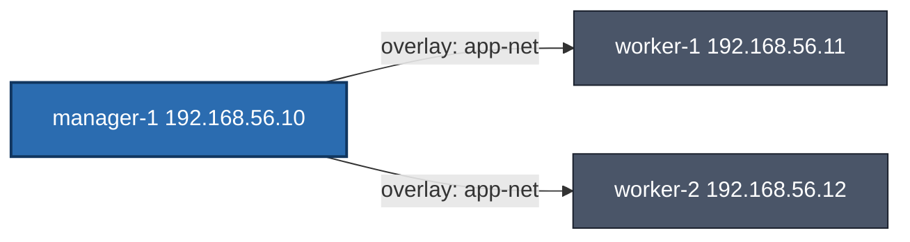

<div dir='rtl'>

## Docker Swarm + Vagrant

### طرح کلان و معماری

## هدف

1. ساخت لَب سه‌ماشینه با Vagrant برای تمرین Swarm
2. توسعه‌ی یک Todo Service با FastAPI + PostgreSQL
3. دیپلوی سرویس به‌صورت Stack روی Docker Swarm با مقیاس‌پذیری، Healthcheck و Rolling Update
4. مدیریت ساده (Portainer اختیاری در فاز پایانی)

## توپولوژی لَب (Swarm)



* شبکه Host-Only: `192.168.56.0/24`
* Swarm init روی **manager-1**، Workers به کلاستر جوین می‌شوند
* **Overlay network** برای سرویس‌ها: `app-net`
* **PostgreSQL** با Volume پایدار (روی manager برای سادگی لَب)
* **API** (FastAPI) با ۳ Replica و Rolling update

---

# ساختار پوشه‌ها (Repository Layout)

</div>

```
swarm-todo-lab/
├─ Vagrantfile
├─ provision/
│  ├─ install_docker.sh          # نصب Docker و compose-plugin
│  ├─ manager.sh                 # init swarm + ساخت overlay + ذخیره توکن
│  └─ worker.sh                  # join به کلاستر
├─ scripts/
│  ├─ deploy_stack.sh            # ساخت secret و deploy stack
│  └─ remove_stack.sh            # حذف stack و پاکسازی
├─ app/
│  ├─ backend/
│  │  ├─ app/
│  │  │  ├─ __init__.py
│  │  │  ├─ main.py              # FastAPI entrypoint
│  │  │  ├─ database.py          # SQLAlchemy Session
│  │  │  ├─ models.py            # Todo model
│  │  │  ├─ schemas.py           # Pydantic DTOs
│  │  │  ├─ crud.py              # عملیات CRUD
│  │  │  └─ routers/
│  │  │     ├─ __init__.py
│  │  │     └─ todos.py          # مسیرهای /todos
│  │  ├─ Dockerfile
│  │  └─ requirements.txt
│  ├─ compose.dev.yml            # اجرا در حالت dev (بدون Swarm)
│  └─ stack.yml                  # فایل stack برای Swarm
├─ .env                          # متغیرهای dev
├─ .env.swarm                    # متغیرهای deploy روی Swarm
├─ Makefile                      # شورتکات‌های اجرایی
└─ README.md
```

<div dir='rtl'>

---

# فازبندی اجرای پروژه

#### فاز 0 — پیش‌نیاز و Bootstrap

**هدف:** آماده‌سازی مخزن و ابزارها
**ابزار لازم روی سیستم شما:**

* VirtualBox (آخرین نسخه پایدار)
* Vagrant (پیشنهادی: 2.4+)
* Git

**خروجی/مسیرها که تکمیل می‌شود:**

* ساختار پوشه‌ها + فایل‌های خالی بالا
* `README.md` اولیه با دستورات

---

#### فاز 1 — ساخت لَب با Vagrant و راه‌اندازی Swarm

**هدف:** سه VM (۱ مدیر + ۲ ورکر) و تشکیل کلاستر Swarm

**فایل‌ها/محتوا (پیشنهاد نهایی برای تأیید):**

---

#### فاز 2 — توسعه Todo API (FastAPI + SQLAlchemy)

**هدف:** پیاده‌سازی CRUD کامل، لایه‌بندی ساده و آماده‌سازی برای کانتینرسازی

#### فاز 3 — اجرای Dev (بدون Swarm) برای تست سریع

#### فاز 4 — آماده‌سازی Stack برای Swarm و دیپلوی

> نکته: برای استفاده از secret داخل env، این ترفند `$(cat /run/secrets/pg_password)` با shell-expansion کار می‌کند چون Swarm به صورت مستقیم secrets را به env تزریق نمی‌کند. در صورت نیاز، entrypoint سفارشی هم می‌توانیم بذاریم. (اگر ترجیح بدی، از متغیر `POSTGRES_PASSWORD_FILE` فقط در db استفاده کنیم و در API از DSN بدون پسورد یا با user/host trust در شبکه داخلی استفاده کنیم—اما این رو فعلاً ساده و امن نگه می‌داریم.)

#### فاز 5 — مقیاس‌پذیری، به‌روزرسانی و مدیریت

**موارد تکمیلی این فاز:**

* افزایش/کاهش Replicaها: `docker service scale todo_api=5`
* تست Rolling Update با تغییر نسخه ایمیج
* محدودیت منابع (CPU/Memory) که در stack.yml گذاشته‌ایم
* (اختیاری) افزودن **Portainer** برای مدیریت آسان Swarm:

  * یک سرویس ساده Portainer روی manager با Volume جهت ذخیره داده‌ها

---

# جدول فازها و فایل‌های هر فاز

| فاز | هدف          | فایل‌ها/مسیرهایی که ساخته یا ویرایش می‌شوند | خروجی قابل تست                  |
| ------ | --------------- | -------------------------------------------------------------------------------- | ------------------------------------------- |
| 0      | Bootstrap       | اسکلت پوشه‌ها، README, .env نمونه                              | —                                          |
| 1      | لَب و Swarm | `Vagrantfile`, `provision/*`                                                 | `docker node ls` در manager             |
| 2      | Backend CRUD    | `app/backend/app/*`, `requirements.txt`, `Dockerfile`                      | اجرای محلی با Uvicorn (پایه) |
| 3      | Dev Compose     | `app/compose.dev.yml`, `.env`                                                | `http://localhost:8000/healthz` و CRUD   |
| 4      | Swarm Stack     | `app/stack.yml`, `.env.swarm`, `scripts/deploy_stack.sh`                   | `http://192.168.56.10:8080`               |
| 5      | Scale/Update    | تغییر `stack.yml`، دستورات scale/update                           | Rolling Update + Scale                      |

# Phase 1

## 🎯 هدف فاز ۱

* ساخت یک لَب سه‌ماشینه با **Vagrant + VirtualBox**
* نصب Docker Engine و پلاگین Compose روی هر نود
* راه‌اندازی یک کلاستر **Docker Swarm**
* ایجاد یک شبکه Overlay مشترک به نام `app-net` برای سرویس‌ها

---

## 📂 ساختار فایل‌ها و مسیرها

```
swarm-todo-lab/
├─ Vagrantfile
├─ provision/
│  ├─ install_docker.sh     # نصب Docker روی هر نود (سازگار با Debian/Ubuntu)
│  ├─ manager.sh            # init Swarm روی مدیر + ساخت شبکه app-net + ذخیره توکن جوین
│  └─ worker.sh             # join به کلاستر با استفاده از توکن ذخیره‌شده
```

---

## 📜 محتوای فایل‌ها

### **`Vagrantfile`**

</div>

```ruby
# -*- mode: ruby -*-
Vagrant.configure("2") do |config|
  config.vm.box = "debian/bullseye64"

  NODES = [
    {name: "manager-1", ip: "192.168.100.7", mem: 2048, cpus: 2, role: "manager"},
    {name: "worker-1",  ip: "192.168.100.8", mem: 1536, cpus: 2, role: "worker"},
    {name: "worker-2",  ip: "192.168.100.9", mem: 1536, cpus: 2, role: "worker"}
  ]

  NODES.each do |node|
    config.vm.define node[:name] do |n|
      n.vm.hostname = node[:name]
      n.vm.network "private_network", ip: node[:ip]
      n.vm.provider "virtualbox" do |vb|
        vb.memory = node[:mem]
        vb.cpus = node[:cpus]
      end

      n.vm.provision "shell", path: "provision/install_docker.sh"

      if node[:role] == "manager"
        n.vm.provision "shell", path: "provision/manager.sh"
      else
        n.vm.provision "shell", path: "provision/worker.sh"
      end
    end
  end
end
```

---

### **`provision/install_docker.sh`**  *(سازگار با Debian و Ubuntu)*

```bash
#!/usr/bin/env bash
set -euo pipefail

# بهبود پایداری apt
cat >/etc/apt/apt.conf.d/99retries <<'CFG'
Acquire::Retries "5";
Acquire::http::Timeout "30";
Acquire::https::Timeout "30";
CFG

# تشخیص توزیع و کدنام
. /etc/os-release
OS_ID="${ID:-}"
CODENAME="${VERSION_CODENAME:-}"

if [[ -z "${OS_ID}" || -z "${CODENAME}" ]]; then
  echo "Cannot detect OS or codename from /etc/os-release"
  exit 1
fi

# پاکسازی لیست‌های قبلی Docker (در صورت وجود)
rm -f /etc/apt/sources.list.d/docker.list || true
install -m 0755 -d /etc/apt/keyrings

# نصب پیش‌نیازها
apt-get update -y || true
apt-get install -y --no-install-recommends ca-certificates curl gnupg lsb-release apt-transport-https

# اضافه کردن کلید Docker
curl -fsSL https://download.docker.com/linux/${OS_ID}/gpg | gpg --yes --dearmor -o /etc/apt/keyrings/docker.gpg
chmod a+r /etc/apt/keyrings/docker.gpg

# اضافه کردن مخزن Docker
case "${OS_ID}" in
  ubuntu)
    echo "deb [arch=$(dpkg --print-architecture) signed-by=/etc/apt/keyrings/docker.gpg] \
https://download.docker.com/linux/ubuntu ${CODENAME} stable" > /etc/apt/sources.list.d/docker.list
    ;;
  debian)
    echo "deb [arch=$(dpkg --print-architecture) signed-by=/etc/apt/keyrings/docker.gpg] \
https://download.docker.com/linux/debian ${CODENAME} stable" > /etc/apt/sources.list.d/docker.list
    ;;
  *)
    echo "Unsupported OS: ${OS_ID}"
    exit 1
    ;;
esac

# آپدیت و نصب Docker
if ! apt-get update -y; then
  # در صورت مشکل HTTPS، به HTTP سوییچ کن
  sed -i 's|https://deb.debian.org|http://deb.debian.org|g' /etc/apt/sources.list 2>/dev/null || true
  sed -i 's|https://security.debian.org|http://security.debian.org|g' /etc/apt/sources.list 2>/dev/null || true
  apt-get update -y
fi

apt-get install -y docker-ce docker-ce-cli containerd.io docker-buildx-plugin docker-compose-plugin

# اضافه کردن کاربر vagrant به گروه docker
usermod -aG docker vagrant || true
systemctl enable docker
systemctl restart docker

echo "Docker installed on ${OS_ID} (${CODENAME})."
```

---

### **`provision/manager.sh`**

```bash
#!/usr/bin/env bash
set -euo pipefail

# پیدا کردن IP نود مدیر به‌صورت خودکار از شبکه 192.168.*
MANAGER_IP="${SWARM_ADVERTISE_IP:-$(ip -4 addr show | awk '/inet 192\.168\./ {print $2}' | cut -d/ -f1 | head -n1)}"

if [[ -z "${MANAGER_IP}" ]]; then
  echo "Cannot detect manager IP automatically. Set SWARM_ADVERTISE_IP."
  exit 1
fi

# راه‌اندازی Swarm
if ! docker info 2>/dev/null | grep -q "Swarm: active"; then
  docker swarm init --advertise-addr "${MANAGER_IP}"
fi

# ساخت شبکه overlay برای سرویس‌ها
docker network ls | grep -q "app-net" || docker network create -d overlay --attachable app-net

# ذخیره توکن join برای ورکرها
WORKER_TOKEN=$(docker swarm join-token -q worker)
cat > /vagrant/provision/join-worker.sh <<EOF
#!/usr/bin/env bash
docker swarm join --token ${WORKER_TOKEN} ${MANAGER_IP}:2377
EOF
chmod +x /vagrant/provision/join-worker.sh

echo "Swarm initialized on ${MANAGER_IP} and app-net created."
```

---

### **`provision/worker.sh`**

```bash
#!/usr/bin/env bash
set -euo pipefail

if docker info 2>/dev/null | grep -q "Swarm: active"; then
  echo "Already in Swarm."
  exit 0
fi

if [[ -x /vagrant/provision/join-worker.sh ]]; then
  /vagrant/provision/join-worker.sh || true
else
  echo "join-worker.sh not ready. Re-provision after manager is up."
fi
```

<div dir='rtl'>
---

## 🛠 مراحل اجرا

### 1) بالا آوردن نود مدیر

```bash
vagrant up manager-1
```

این کار:

* سیستم عامل Debian bullseye64 را بالا می‌آورد.
* Docker و compose-plugin را نصب می‌کند.
* Swarm را init می‌کند.
* شبکه overlay به نام `app-net` می‌سازد.
* توکن join برای ورکرها را ذخیره می‌کند.

---

### 2) بالا آوردن دو نود ورکر

```bash
vagrant up worker-1 worker-2
```

این کار:

* هر ورکر را بالا می‌آورد.
* Docker نصب می‌شود.
* با استفاده از `join-worker.sh` به Swarm متصل می‌شوند.

---

### 3) بررسی وضعیت کلاستر

روی مدیر:

```bash
vagrant ssh manager-1 -c "docker node ls"
```

خروجی مورد انتظار:

```
ID                            HOSTNAME    STATUS    AVAILABILITY   MANAGER STATUS   ENGINE VERSION
xxxx...                       manager-1   Ready     Active         Leader           28.x.x
yyyy...                       worker-1    Ready     Active                          28.x.x
zzzz...                       worker-2    Ready     Active                          28.x.x
```

---

### 4) بررسی شبکه overlay

```bash
vagrant ssh manager-1 -c "docker network ls | grep app-net"
```

باید `app-net` را ببینی:

```
td2aaorzznb6   app-net           overlay   swarm
```

---

## ✅ نتیجه فاز ۱

* سه نود Swarm فعال داریم.
* همه نودها `Ready` هستند.
* شبکه `app-net` برای سرویس‌های آینده آماده است.

---

# Phase 2

در این فاز فقط می‌خواهیم سرویس‌ها را با Docker Compose روی **همان نود manager-1** بالا بیاوریم و CRUD را تست کنیم. (هنوز Swarm/stack در کار نیست.)

---

## پیش‌نیاز

```
swarm-todo-lab/
│ 
├─ app/
│  ├─ backend/
│  │  ├─ app/
│  │  │  ├─ __init__.py
│  │  │  ├─ main.py              # FastAPI entrypoint
│  │  │  ├─ database.py          # SQLAlchemy Session
│  │  │  ├─ models.py            # Todo model
│  │  │  ├─ schemas.py           # Pydantic DTOs
│  │  │  ├─ crud.py              # عملیات CRUD
│  │  │  └─ routers/
│  │  │     ├─ __init__.py
│  │  │     └─ todos.py          # مسیرهای /todos
│  │  ├─ Dockerfile
│  │  └─ requirements.txt
│  ├─ compose.dev.yml            # اجرا در حالت dev (بدون Swarm)
│  └─ stack.yml                  # فایل stack برای Swarm
```

* در `routers/todos.py`، روی `startup` جدول‌ها با `Base.metadata.create_all` ساخته می‌شوند؛ پس نیازی به migration جدا نداریم.

> نکته: این نسخه برای **فاز ۲ (dev-compose)** و **آمادگی اولیه Swarm** کفایت می‌کند. بعداً در فاز Swarm، اگر خواستی Secret هم اضافه کنیم، فقط `stack.yml` را کمی بهبود می‌دهیم.

---

## 1) `app/backend/app/__init__.py`

```python
# خالی بماند؛ فقط برای پکیج‌شدن ماژول
```

## 2) `app/backend/app/database.py`

```python
from sqlalchemy import create_engine
from sqlalchemy.orm import sessionmaker, declarative_base
import os

# در dev-compose: postgresql://todo:todo@db:5432/todo_db
# در Swarm (ساده): از env مشابه استفاده می‌کنیم
DB_URL = os.getenv("DATABASE_URL", "postgresql://todo:todo@db:5432/todo_db")

engine = create_engine(DB_URL, pool_pre_ping=True)
SessionLocal = sessionmaker(autocommit=False, autoflush=False, bind=engine)
Base = declarative_base()
```

## 3) `app/backend/app/models.py`

```python
from sqlalchemy import Column, Integer, String, Boolean, DateTime, func
from .database import Base

class Todo(Base):
    __tablename__ = "todos"
    id = Column(Integer, primary_key=True, index=True)
    title = Column(String(200), nullable=False)
    description = Column(String(1000), nullable=True)
    is_done = Column(Boolean, default=False, nullable=False)
    created_at = Column(DateTime(timezone=True), server_default=func.now())
```

## 4) `app/backend/app/schemas.py`

```python
from pydantic import BaseModel

class TodoCreate(BaseModel):
    title: str
    description: str | None = None

class TodoUpdate(BaseModel):
    title: str | None = None
    description: str | None = None
    is_done: bool | None = None

class TodoOut(BaseModel):
    id: int
    title: str
    description: str | None
    is_done: bool

    class Config:
        from_attributes = True
```

## 5) `app/backend/app/crud.py`

```python
from sqlalchemy.orm import Session
from . import models, schemas

def create_todo(db: Session, data: schemas.TodoCreate):
    todo = models.Todo(title=data.title, description=data.description)
    db.add(todo)
    db.commit()
    db.refresh(todo)
    return todo

def list_todos(db: Session):
    return db.query(models.Todo).order_by(models.Todo.id.desc()).all()

def get_todo(db: Session, todo_id: int):
    return db.get(models.Todo, todo_id)

def update_todo(db: Session, todo_id: int, data: schemas.TodoUpdate):
    todo = db.get(models.Todo, todo_id)
    if not todo:
        return None
    for k, v in data.model_dump(exclude_unset=True).items():
        setattr(todo, k, v)
    db.commit()
    db.refresh(todo)
    return todo

def delete_todo(db: Session, todo_id: int):
    todo = db.get(models.Todo, todo_id)
    if not todo:
        return False
    db.delete(todo)
    db.commit()
    return True
```

## 6) `app/backend/app/routers/__init__.py`

```python
# خالی
```

## 7) `app/backend/app/routers/todos.py`

```python
from fastapi import APIRouter, Depends, HTTPException
from sqlalchemy.orm import Session
from ..database import SessionLocal, Base, engine
from .. import schemas, crud

router = APIRouter(prefix="/todos", tags=["todos"])

def get_db():
    db = SessionLocal()
    try:
        yield db
    finally:
        db.close()

@router.on_event("startup")
def on_startup():
    # برای سادگی آموزشی: ساخت جدول‌ها در استارتاپ
    Base.metadata.create_all(bind=engine)

@router.get("/", response_model=list[schemas.TodoOut])
def list_(db: Session = Depends(get_db)):
    return crud.list_todos(db)

@router.post("/", response_model=schemas.TodoOut, status_code=201)
def create_(data: schemas.TodoCreate, db: Session = Depends(get_db)):
    return crud.create_todo(db, data)

@router.get("/{todo_id}", response_model=schemas.TodoOut)
def get_(todo_id: int, db: Session = Depends(get_db)):
    todo = crud.get_todo(db, todo_id)
    if not todo:
        raise HTTPException(404, "Not found")
    return todo

@router.put("/{todo_id}", response_model=schemas.TodoOut)
def update_(todo_id: int, data: schemas.TodoUpdate, db: Session = Depends(get_db)):
    todo = crud.update_todo(db, todo_id, data)
    if not todo:
        raise HTTPException(404, "Not found")
    return todo

@router.delete("/{todo_id}", status_code=204)
def delete_(todo_id: int, db: Session = Depends(get_db)):
    ok = crud.delete_todo(db, todo_id)
    if not ok:
        raise HTTPException(404, "Not found")
```

## 8) `app/backend/app/main.py`

```python
from fastapi import FastAPI
from .routers import todos

app = FastAPI(title="Swarm Todo API")
app.include_router(todos.router)

@app.get("/healthz")
def health():
    return {"status": "ok"}
```

## 9) `app/backend/requirements.txt`

```
fastapi==0.115.0
uvicorn[standard]==0.30.6
SQLAlchemy==2.0.34
psycopg2-binary==2.9.9
pydantic==2.9.1
```

## 10) `app/backend/Dockerfile`

```dockerfile
FROM python:3.11-slim

ENV PYTHONDONTWRITEBYTECODE=1 PYTHONUNBUFFERED=1
WORKDIR /app

# برای psycopg2-binary به gcc نیاز داریم (بسته‌ها را کم نگه می‌داریم)
RUN apt-get update && apt-get install -y --no-install-recommends gcc && rm -rf /var/lib/apt/lists/*

COPY app/backend/requirements.txt .
RUN pip install --no-cache-dir -r requirements.txt

COPY app/backend/app ./app

EXPOSE 8000
CMD ["uvicorn", "app.main:app", "--host","0.0.0.0","--port","8000"]
```

## 11) `app/compose.dev.yml`

```yaml
version: "3.9"

services:
  db:
    image: postgres:16
    environment:
      POSTGRES_USER: todo
      POSTGRES_PASSWORD: todo
      POSTGRES_DB: todo_db
    volumes:
      - todo_pg_data:/var/lib/postgresql/data
    ports:
      - "54320:5432"

  api:
    build:
      context: ..
      dockerfile: app/backend/Dockerfile
    environment:
      DATABASE_URL: postgresql://todo:todo@db:5432/todo_db
    depends_on:
      - db
    ports:
      - "8000:8000"

volumes:
  todo_pg_data:
```

## 12) `app/stack.yml`

> ساده‌ترین نسخه برای Swarm (فعلاً بدون secret برای ساده‌سازی آموزشی). بعداً می‌تونیم Secret اضافه کنیم و `start.sh` بذاریم.

```yaml
version: "3.9"

networks:
  app-net:
    external: true

volumes:
  pg_data:

services:
  db:
    image: postgres:16
    environment:
      POSTGRES_USER: ${POSTGRES_USER:-todo}
      POSTGRES_PASSWORD: ${POSTGRES_PASSWORD:-todo}
      POSTGRES_DB: ${POSTGRES_DB:-todo_db}
    volumes:
      - pg_data:/var/lib/postgresql/data
    networks:
      - app-net
    deploy:
      placement:
        constraints:
          - node.role == manager
      restart_policy:
        condition: on-failure
      resources:
        limits:
          cpus: "0.50"
          memory: 512M

  api:
    build:
      context: ..
      dockerfile: app/backend/Dockerfile
    environment:
      DATABASE_URL: postgresql://${POSTGRES_USER:-todo}:${POSTGRES_PASSWORD:-todo}@db:5432/${POSTGRES_DB:-todo_db}
    depends_on:
      - db
    networks:
      - app-net
    ports:
      - "8080:8000"
    deploy:
      replicas: 3
      update_config:
        parallelism: 1
        delay: 10s
        failure_action: rollback
        order: start-first
      restart_policy:
        condition: on-failure
      resources:
        limits:
          cpus: "0.25"
          memory: 256M
      healthcheck:
        test: ["CMD-SHELL", "wget -qO- http://localhost:8000/healthz || exit 1"]
        interval: 10s
        timeout: 2s
        retries: 5
        start_period: 10s
```

---


 ## 1. اجرای Compose روی manager-1

روی ماشین میزبان (سیستم خودت)، دستور زیر را بزن تا داخل VM اجرا شود:

```bash
# برای ارسال کل ساختار  appبه درون نود manager
vagrant reload manager-1

# وارد نود manager شدن
vagrant ssh manager-1


cd /vagrant/app

docker compose -f compose.dev.yml up --build -d
docker compose -f compose.dev.yml ps
```

**انتظار خروجی `ps`:**

* سرویس `db` با وضعیت `running`
* سرویس `api` با وضعیت `running` و مپ‌شدن پورت `8000:8000`

---

## 2.  تست Health و CRUD

### Health

```bash
# داخل manager-1
curl -s http://localhost:8000/healthz
# خروجی:
# {"status":"ok"}
```

### ایجاد یک تسک (Create)

```bash
# ایجاد تسک
curl -s -H 'Content-Type: application/json' \
  -d '{"title":"first task","description":"via dev compose"}' \
  http://localhost:8000/todos/
```

### لیست‌گرفتن (Read/List)

```bash
# لیست
curl -s http://localhost:8000/todos/
# خروجی آرایه‌ای از تسک‌ها؛ تسک ایجادشده را باید ببینی
```

### خواندن یک آیتم خاص (Read/By ID)

```bash
curl -s http://localhost:8000/todos/1
```

### بروزرسانی (Update)

```bash
curl -sX PUT http://localhost:8000/todos/1 \
  -H 'Content-Type: application/json' \
  -d '{"is_done": true}'
```

### حذف (Delete)

```bash
curl -s -X DELETE http://localhost:8000/todos/1 -i | head -n1
# باید Status 204 ببینی
```

> اگر می‌خواهی از میزبان (خارج از VM) تست کنی:
>
> * پورت dev به `8000:8000` مپ شده. اما چون داخل VM است، لازم است پورت ماشین مجازی را هم فوروارد کنیم یا با SSH port-forward تست بزنیم. ساده‌ترین راه در این فاز: تست‌ها را داخل خود **manager-1** بزن تا مطمئن شویم کد صحیح کار می‌کند.

---

## 3. مشاهده لاگ‌ها و خطایابی سریع

### لاگ‌ها

```bash
docker compose -f compose.dev.yml logs -f api
docker compose -f compose.dev.yml logs -f db
```

### مجدد‌سازی جدول‌ها (در صورت خطای دیتابیس)

* سرویس `api` روی استارتاپ جدول‌ها را می‌سازد. اگر قبل از آماده‌شدن DB بالا آمده باشد و خطا بدهد:

```bash
docker compose -f compose.dev.yml restart api
```

### ریست کامل Dev (بدون از دست‌دادن دیتا)

```bash
docker compose -f compose.dev.yml down
docker compose -f compose.dev.yml up -d
```

### پاک‌کردن کامل دیتا Dev (Volume)

```bash
docker compose -f compose.dev.yml down -v
docker compose -f compose.dev.yml up --build -d
```

---
## 4. بررسی db

+ دیدن حداول

```bash
# درون محیط manager
vagrant ssh manager-1  

docker exec -it app-db-1 psql -U todo -d todo_db -c '\dt'

```

#### output:
          List of relations
    Schema | Name  | Type  | Owner 
    --------+-------+-------+-------
    public | todos | table | todo
               (1 row)

+  دیدن رکورد ها

```bash
docker exec -it app-db-1 psql -U todo -d todo_db -c 'SELECT * FROM todos ORDER BY id DESC;'

```

    id |   title    |   description   | is_done |          created_at           
    ----+------------+-----------------+---------+-------------------------------
      2 | first task | via dev compose | f       | 2025-08-14 09:40:21.353212+00
    (1 row)


## 5. جمع‌بندی فاز ۲

* API با Compose بالا آمده و با PostgreSQL Dev کار می‌کند.
* CRUD تست شد و پاسخ صحیح گرفتیم.
* با این اطمینان، می‌توانیم وارد **فاز ۳ (آماده‌سازی Swarm Stack)** شویم:

  * اضافه‌کردن `start.sh` برای خواندن Secret پسورد از Swarm
  * اصلاح `Dockerfile` برای استفاده از `start.sh`
  * به‌روزرسانی `app/stack.yml` تا `api` از Secret استفاده کند
  * اسکریپت‌های deploy/remove که آماده‌اند

# Phase 3

# اصلاحات مینیمال (بدون اضافه‌کردن فایل)

## 1) به‌روزرسانی `app/backend/Dockerfile`

فقط **دستور CMD** را عوض کن تا اگر Secret موجود بود از آن استفاده کند، وگرنه در Dev از پسورد env ساده استفاده شود:

```dockerfile
FROM python:3.11-slim

ENV PYTHONDONTWRITEBYTECODE=1 PYTHONUNBUFFERED=1
WORKDIR /app

RUN apt-get update && apt-get install -y --no-install-recommends gcc && rm -rf /var/lib/apt/lists/*
COPY app/backend/requirements.txt .
RUN pip install --no-cache-dir -r requirements.txt

COPY app/backend/app ./app

EXPOSE 8000
# ⬇️ بدون افزودن فایل جدید؛ خواندن secret در صورت وجود
CMD ["/bin/sh","-c","\
  : ${POSTGRES_USER:=todo}; \
  : ${POSTGRES_DB:=todo_db}; \
  : ${POSTGRES_HOST:=db}; \
  if [ -f /run/secrets/pg_password ]; then \
    DB_PASS=$(cat /run/secrets/pg_password); \
  else \
    DB_PASS=${POSTGRES_PASSWORD:-todo}; \
  fi; \
  export DATABASE_URL=postgresql://${POSTGRES_USER}:${DB_PASS}@${POSTGRES_HOST}:5432/${POSTGRES_DB}; \
  exec uvicorn app.main:app --host 0.0.0.0 --port 8000 \
"]
```

* Dev (Compose): از `POSTGRES_PASSWORD=todo` استفاده می‌شود.
* Swarm: اگر Secret `pg_password` mount شده باشد، از آن خوانده می‌شود.

> هیچ فایل جدیدی اضافه نشد؛ فقط خود `Dockerfile` تغییر کرد.

---

## 2) به‌روزرسانی `app/stack.yml`

همان ساختار قبلی را نگه می‌داریم؛ فقط اطمینان می‌دهیم Secret به هر دو سرویس داده شود، و DB از `POSTGRES_PASSWORD_FILE` بهره ببرد. (در API فقط **mount** می‌کنیم؛ خواندنش را همان CMD انجام می‌دهد.)

```yaml
version: "3.9"

secrets:
  pg_password:
    external: true

networks:
  app-net:
    external: true

volumes:
  pg_data:

services:
  db:
    image: postgres:16
    environment:
      POSTGRES_USER: ${POSTGRES_USER:-todo}
      POSTGRES_DB: ${POSTGRES_DB:-todo_db}
      POSTGRES_PASSWORD_FILE: /run/secrets/pg_password
    secrets:
      - pg_password
    volumes:
      - pg_data:/var/lib/postgresql/data
    networks:
      - app-net
    deploy:
      placement:
        constraints:
          - node.role == manager
      restart_policy:
        condition: on-failure
      resources:
        limits:
          cpus: "0.50"
          memory: 512M

  api:
    # برای لَب ساده: ایمیج را لوکال روی manager می‌سازیم
    image: swarm-todo-api:1.0.0
    environment:
      POSTGRES_USER: ${POSTGRES_USER:-todo}
      POSTGRES_DB: ${POSTGRES_DB:-todo_db}
      POSTGRES_HOST: db
      # توجه: پاس‌دادن پسورد از طریق env برای Swarm لازم نیست—CMD خودش از secret می‌خواند
    secrets:
      - pg_password
    depends_on:
      - db
    networks:
      - app-net
    ports:
      - "8080:8000"
    deploy:
      replicas: 2
      placement:
        constraints:
          - node.role == manager      # تا وقتی رجیستری نداریم
      update_config:
        parallelism: 1
        delay: 10s
        failure_action: rollback
        order: start-first
      restart_policy:
        condition: on-failure
      resources:
        limits:
          cpus: "0.25"
          memory: 256M
      healthcheck:
        test: ["CMD-SHELL", "wget -qO- http://localhost:8000/healthz || exit 1"]
        interval: 10s
        timeout: 2s
        retries: 5
        start_period: 10s
```

> معماری/مسیرها/نام‌ها عین نقشه اولیه حفظ شده‌اند.

---
# Phase 4

## 1) تصویر کلی معماری

```
Host (Laptop) ─┐
               ├── Vagrant + VirtualBox
               │
               └── VM: manager-1 (192.168.100.7)
                    ├── Docker Swarm (Manager, Leader)
                    ├── Overlay Network: todo_todo_net
                    ├── Stack: todo
                    │   ├── Service: todo_db  (postgres:16)
                    │   │   └── Volume: todo_pg_data  (داده‌ی پایدار Postgres)
                    │   └── Service: todo_api (swarm-todo-api:1.0.1)
                    │       └── Published Port: 8080 -> 8000
                    └── مسیر پروژه: /vagrant (bind mount از میزبان)
```

```
swarm-todo-lab/
│
├─ app/
│  ├─ backend/
│  │  ├─ app/
│  │  │  ├─ __init__.py
│  │  │  ├─ main.py              # FastAPI entrypoint
│  │  │  ├─ database.py          # SQLAlchemy Session
│  │  │  ├─ models.py            # Todo model
│  │  │  ├─ schemas.py           # Pydantic DTOs
│  │  │  ├─ crud.py              # عملیات CRUD
│  │  │  └─ routers/
│  │  │     ├─ __init__.py
│  │  │     └─ todos.py          # مسیرهای /todos
│  │  ├─ Dockerfile
│  │  └─ requirements.txt
│  ├─ compose.dev.yml            # اجرا در حالت dev (بدون Swarm)
│  └─ stack.yml                  # فایل stack برای Swarm
├─ .env                          # متغیرهای dev
└─ .env.swarm                    # متغیرهای deploy روی Swarm
```

* **API** از طریق **VIP** روی شبکه‌ی overlay به سرویس **db** (نام سرویس: `db`) وصل می‌شود.
* **پایگاه‌داده** روی **Postgres 16** اجرا می‌شود (مهم: با نسخه 16 init شده؛ پس باید با 16 بماند مگر اینکه ولوم را پاک کنید).
* برای **سادگی آموزشی** در فاز ۴، **از Secret صرف‌نظر کردیم** و **`DATABASE_URL`** را **مستقیم** از env ساختیم (امنیت قابل قبول در لاب؛ در تولید بهتر است Secret).

---

## 2) ساختار فایل‌ها (فقط قطعات مؤثر در فاز ۴)

### 2.1) `.env.swarm` (ریشه‌ی repo: `swarm-todo-lab/.env.swarm`)

> روی **manager-1** از همین فایل envها را بارگذاری می‌کنیم تا جایگزینی `${...}` در `stack.yml` عمل کند.

```env
POSTGRES_USER=todo
POSTGRES_PASSWORD=StrongPass123!
POSTGRES_DB=todo_db
```

> نکته: **این فایل داخل VM در `/vagrant/.env.swarm`** قرار دارد.

---

### 2.2) `app/stack.yml` (نهایی، ساده و پایدار)

> این نسخه همان است که اکنون کار می‌کند: **Postgres 16** + **DATABASE\_URL مستقیم**.

```yaml
version: "3.9"

networks:
  todo_net: {}

volumes:
  todo_pg_data: {}

services:
  db:
    image: postgres:16
    environment:
      POSTGRES_USER: ${POSTGRES_USER}
      POSTGRES_DB: ${POSTGRES_DB}
      POSTGRES_PASSWORD: ${POSTGRES_PASSWORD}
    volumes:
      - todo_pg_data:/var/lib/postgresql/data
    networks:
      - todo_net
    deploy:
      placement:
        constraints:
          - node.role == manager

  api:
    image: swarm-todo-api:1.0.1
    environment:
      # ساخت DSN مستقیم از env (ساده‌ترین مسیر آموزشی)
      DATABASE_URL: postgresql://${POSTGRES_USER}:${POSTGRES_PASSWORD}@db:5432/${POSTGRES_DB}
    ports:
      - "8080:8000"
    networks:
      - todo_net
    # توجه: depends_on در Swarm ترتیب و Health را تضمین نمی‌کند؛ اینجا حذف شده
    deploy:
      replicas: 1
      placement:
        constraints:
          - node.role == manager
```

**چرا این نسخه پایدار است؟**

* از **\$(...)** داخل YAML خبری نیست (Swarm YAML شِل‌اکسپند نمی‌کند).
* هر دو سرویس **از همان env** استفاده می‌کنند، پس mismatch پسورد نداریم.
* نسخه‌ی Postgres با داده‌ی ولوم هم‌خوان است (16 ← 16).

---

### 2.3) `app/backend/Dockerfile` (نسخه Minimal برای Swarm)

> همین که الان باهاش build می‌کنی.

```dockerfile
FROM python:3.11-slim

ENV PYTHONDONTWRITEBYTECODE=1 PYTHONUNBUFFERED=1
WORKDIR /app

# ابزارهای موردنیاز (psycopg2 → gcc لازم؛ تست‌های ping به DB → postgresql-client)
RUN apt-get update \
 && apt-get install -y --no-install-recommends gcc bash curl postgresql-client \
 && rm -rf /var/lib/apt/lists/*

COPY app/backend/requirements.txt .
RUN pip install --no-cache-dir -r requirements.txt

COPY app/backend/app ./app

EXPOSE 8000
CMD ["python", "-m", "uvicorn", "app.main:app", "--host", "0.0.0.0", "--port", "8000"]
```

> نکته: **هیچ entrypoint پیچیده‌ای نداریم**؛ سادگی را حفظ کردیم.

---

### 2.4) `app/backend/app/database.py` (الگوی نهایی با `DATABASE_URL`)

> نسخه‌ای که با `DATABASE_URL` به‌خوبی کار می‌کند (هم در dev، هم در swarm):

```python
from sqlalchemy import create_engine
from sqlalchemy.orm import sessionmaker, declarative_base
import os

# در dev/Swarm با env ست می‌شود:
DB_URL = os.getenv("DATABASE_URL", "postgresql://todo:todo@db:5432/todo_db")

engine = create_engine(DB_URL, pool_pre_ping=True)
SessionLocal = sessionmaker(autocommit=False, autoflush=False, bind=engine)
Base = declarative_base()
```

> اگر بعداً خواستی Secret-File استفاده کنی، می‌توانیم اینجا DSN را از فایل پسورد بسازیم (در بخش «گزینه حرفه‌ای» آمده است).

---

## 3) گام‌های اجرا (دقیق، با محل اجرای هر دستور)

> **همهٔ دستورات این بخش روی VM `manager-1` اجرا می‌شوند.**
>
> ورود به VM (از میزبان):
>
> ```bash
> vagrant ssh manager-1
> ```

### 3.1) بارگذاری env

```bash
cd /vagrant
set -a; . ./.env.swarm; set +a
```

### 3.2) ساخت ایمیج API (روی manager-1 و در `/vagrant`)

```bash
docker image build --no-cache -t swarm-todo-api:1.0.1 -f app/backend/Dockerfile .
```

> اگر کلاستر چندنودی فعال داری و سرویس روی workerها هم scheduling شود:
>
> * یا **روی هر نود همان ایمیج را build** کن،
> * یا ایمیج را در **Registry مشترک** push کن و در `stack.yml` از نام رجیستری استفاده کن.

### 3.3) دیپلوی Stack

```bash
docker stack deploy -c app/stack.yml todo
```

### 3.4) بررسی وضعیت

```bash
docker stack services todo
docker service ps todo_db
docker service ps todo_api
docker service logs -f todo_db
docker service logs -f todo_api
```

باید چیزی شبیه زیر ببینی:

```
ID   NAME      MODE       REPLICAS  IMAGE                 PORTS
...  todo_db   replicated 1/1       postgres:16
...  todo_api  replicated 1/1       swarm-todo-api:1.0.1  *:8080->8000/tcp
```

### 3.5) تست API

```bash
# health
curl -s http://192.168.100.7:8080/healthz
# → {"status":"ok"}

# ایجاد یک TODO
curl -s -H 'Content-Type: application/json' \
  -d '{"title":"task on swarm","description":"env-only simple path"}' \
  http://192.168.100.7:8080/todos/
# → {"id":1,"title":"task on swarm","description":"env-only simple path","is_done":false}

# لیست
curl -s http://192.168.100.7:8080/todos/
# → [{"id":1,"title":"task on swarm",...}]
```

---

## 4) مهم‌ترین نکات و دام‌ها (با علت و راه‌حل دقیق)

### 4.1) **نسخه‌ی Postgres و ولوم**

* خطا:

  ```
  The data directory was initialized by PostgreSQL version 16,
  which is not compatible with this version 15.13
  ```
* علت: ولوم `todo_pg_data` قبلاً با **Postgres 16** init شده بود؛ وقتی ایمیج را به **15** تغییر دادیم، DB بالا نیامد.
* راه‌حل‌ها:

  * **راه ساده:** روی **16** بمان (همان‌طور که الان هست).
  * **راه دیگر:** اگر خواستی به 15 تغییر دهی، **ولوم را پاک کن** تا از نو init شود:

    ```bash
    docker stack rm todo
    sleep 5
    docker volume rm todo_pg_data
    # سپس deploy مجدد
    ```

### 4.2) **پسورد DB و پایداری با Volume**

* اگر Postgres با پسوردی init شده باشد، **تغییر env** در دیپلوی بعدی **پسورد را عوض نمی‌کند**.
* برای تغییر واقعی پسورد:

  * یا **ولوم را پاک کن** تا init جدید با پسورد جدید انجام شود.
  * یا با ابزارهای Postgres کاربر/پسورد را داخل DB تغییر بده (برای لاب آموزشی، پاک‌کردن ولوم ساده‌تر است).

### 4.3) **استفاده از `$(cat ...)` داخل `stack.yml` ممنوع**

* Swarm فایل YAML را با **shell** تفسیر نمی‌کند. عبارت‌های `$(...)` باعث خطای parsing می‌شوند:

  ```
  invalid interpolation format ...
  ```
* راه‌حل‌ها:

  * یا **DATABASE\_URL** را با `${...}` از `.env.swarm` بساز (الگوی نهایی ما).
  * یا از Secret-File استفاده کن و **داخل کد** فایل پسورد را بخوان (گزینهٔ حرفه‌ایِ بعدی).

### 4.4) **depends\_on در Swarm**

* در Swarm، `depends_on` مانند Compose **منتظر health سرویس دیگر نمی‌ماند**.
* بنابراین نباید روی آن برای ترتیب واقعی start/ready حساب کنی.
  (ما حذفش کردیم و API به خوبی کار می‌کند؛ اگر نیاز شد، در API retry/pg\_isready اضافه می‌کنیم.)

### 4.5) **نام سرویس DB در DSN**

* در شبکهٔ overlay، **نام سرویس** رزولوشن DNS است، نه نام کانتینر.
  پس **هاست را `db`** بگذار، چون سرویس DB در `stack.yml` با نام `db` تعریف شده است.
  (اشتباه‌هایی مثل `todo_db` یا `postgres` باعث خطای name resolution می‌شود.)

### 4.6) **Local Image و چند نودی**

* پیام:

  ```
  image swarm-todo-api:1.0.1 could not be accessed on a registry ...
  ```
* یعنی Swarm digest واحدی ثبت نکرده؛ اگر task روی نود دیگر schedule شود و آن نود ایمیج را نداشته باشد، fail می‌شود.
* راه‌حل:

  * روی **همهٔ نودها** build کن **یا**
  * ایمیج را **push** کن و از رجیستری مشترک بگیر.

### 4.7) **عدم وجود ابزارهای موردنیاز داخل ایمیج**

* اگر تصمیم بگیری قبل از اجرای API، `pg_isready`/`nc` اجرا کنی، باید **داخل Dockerfile** ابزارها را نصب کرده باشی.
  (ما الان ساده کردیم و این مرحله را نداریم؛ اما `postgresql-client` را نگه داشتیم که مفید است.)

---

## 5) «گزینهٔ حرفه‌ای» (اختیاری): بازگشت به Secret-File (امن‌تر)

اگر بعداً خواستی **پسورد را از Secret بخوانی**:

### 5.1) ساخت Secret از `.env.swarm`

```bash
cd /vagrant
set -a; . ./.env.swarm; set +a
printf "%s" "$POSTGRES_PASSWORD" | docker secret create todo_pg_password -
```

> اگر Secret موجود است و با سرویس‌ها در حال استفاده، ابتدا **Stack را بردار**، بعد Secret را حذف/بساز:

```bash
docker stack rm todo
sleep 5
docker secret rm todo_pg_password
printf "%s" "$POSTGRES_PASSWORD" | docker secret create todo_pg_password -
```

### 5.2) تغییر `stack.yml`

```yaml
services:
  db:
    image: postgres:16
    environment:
      POSTGRES_USER: ${POSTGRES_USER}
      POSTGRES_DB: ${POSTGRES_DB}
      POSTGRES_PASSWORD_FILE: /run/secrets/todo_pg_password
    secrets: [todo_pg_password]
    ...

  api:
    image: swarm-todo-api:1.0.1
    environment:
      POSTGRES_USER: ${POSTGRES_USER}
      POSTGRES_DB: ${POSTGRES_DB}
      POSTGRES_HOST: db
      POSTGRES_PASSWORD_FILE: /run/secrets/todo_pg_password
    secrets: [todo_pg_password]
    ...

secrets:
  todo_pg_password:
    external: true
```

### 5.3) تغییر `database.py` برای خواندن از فایل Secret

```python
import os
from sqlalchemy import create_engine
from sqlalchemy.orm import sessionmaker, declarative_base

def get_db_url():
    # اگر DATABASE_URL ست شده، همان را استفاده کن (انعطاف dev/prod)
    dsn = os.getenv("DATABASE_URL")
    if dsn:
        return dsn

    pw_file = os.getenv("POSTGRES_PASSWORD_FILE")
    if not pw_file:
        # fallback ساده؛ صرفاً برای حالت آموزشی
        return "postgresql://todo:todo@db:5432/todo_db"

    with open(pw_file, "r") as f:
        password = f.read().strip()

    user = os.getenv("POSTGRES_USER", "todo")
    db   = os.getenv("POSTGRES_DB", "todo_db")
    host = os.getenv("POSTGRES_HOST", "db")
    return f"postgresql://{user}:{password}@{host}:5432/{db}"

DB_URL = get_db_url()
engine = create_engine(DB_URL, pool_pre_ping=True)
SessionLocal = sessionmaker(autocommit=False, autoflush=False, bind=engine)
Base = declarative_base()
```

> یادآوری: Secret در حال استفاده را **نمی‌توان مستقیم overwrite** کرد؛ یا Stack را پایین بیاور، یا با **اسم جدید Secret** سرویس را update کن.

---

## 6) دستورهای نگهداری و عیب‌یابی

* وضعیت سرویس‌ها:

  ```bash
  docker stack services todo
  docker service ps todo_api
  docker service ps todo_db
  ```

* لاگ‌ها:

  ```bash
  docker service logs -f todo_api
  docker service logs -f todo_db
  ```

* پاک‌سازی کامل (ولوم و سرویس‌ها):

  ```bash
  docker stack rm todo
  sleep 5
  docker volume rm todo_pg_data 2>/dev/null || true

  # اگر خالی بود:
  # docker service ls -q | xargs -r docker service rm
  ```

* رولینگ آپدیت API (بدون ویرایش فایل):

  ```bash
  docker build -t swarm-todo-api:1.0.2 -f app/backend/Dockerfile /vagrant
  docker service update --image swarm-todo-api:1.0.2 todo_api
  # برگشت:
  # docker service update --image swarm-todo-api:1.0.1 todo_api
  ```

---

## 7) چک‌لیست نهایی فاز ۴

* [x] `stack.yml` به نسخه‌ی **ساده و پایدار** (بدون secret) تنظیم شد.
* [x] نسخه‌ی Postgres برابر با دیتای ولوم: **16**.
* [x] `DATABASE_URL` از `.env.swarm` ساخته می‌شود (با `set -a`).
* [x] API و DB هر دو `1/1` Running.
* [x] تست‌های `healthz`, `POST /todos`, `GET /todos` موفق.
* [x] دام‌های مهم (نسخه Postgres، پسورد، \$(...) در YAML، depends\_on) برطرف و مستند شد.
* [x] مسیر حرفه‌ایِ Secret-File نیز مستند شد (اختیاری برای فاز بعد).

---

اگر بخواهی، می‌تونم همین محتوای مستند را به‌صورت یک **README مخصوص فاز ۴** (با همین فایل‌ها و دستورهای دقیق) در repo اضافه کنم تا همیشه مرجع داشته باشی.
