<div dir='rtl'>

# Docker Swarm Consept

## 📌 مقدمه

این بخش به معرفی مفاهیم کلیدی **مدیریت کلاستر (Cluster Management)** و **ارکستریشن (Orchestration)** در **Docker Engine 1.12** می‌پردازد. این قابلیت‌ها با استفاده از **Swarmkit** پیاده‌سازی شده‌اند. **Swarmkit** یک پروژه مستقل است که لایه ارکستریشن Docker را پیاده‌سازی می‌کند و مستقیماً در Docker استفاده می‌شود.

---

## 🐳 Swarm چیست؟

یک **Swarm** مجموعه‌ای از چندین **Docker Host** است که در حالت **Swarm Mode** اجرا می‌شوند و می‌توانند دو نقش ایفا کنند:

1. **مدیر (Manager)** → مدیریت عضویت، هماهنگی و توزیع وظایف.
2. **کارگر (Worker)** → اجرای سرویس‌های Swarm.

یک **Docker Host** می‌تواند:

* فقط **Manager** باشد،
* فقط **Worker** باشد،
* یا هر دو نقش را هم‌زمان داشته باشد.

### 🔹 مثال واقعی:

فرض کنید یک فروشگاه آنلاین دارید که باید همیشه در دسترس باشد. شما ۵ سرور دارید:

* ۲ سرور به عنوان **Manager** برای کنترل و هماهنگی.
* ۳ سرور به عنوان **Worker** برای اجرای درخواست‌ها و پردازش سفارشات.

اگر یکی از Workerها از کار بیفتد، Swarm به صورت خودکار وظایف آن را به دیگر Workerها منتقل می‌کند.

---

## 🎯 Desired State (وضعیت مطلوب)

وقتی یک سرویس ایجاد می‌کنید، مواردی مانند:

* تعداد Replicaها،
* منابع شبکه و ذخیره‌سازی،
* پورت‌های باز به بیرون،
* و سایر تنظیمات

را مشخص می‌کنید. Swarm به طور خودکار تلاش می‌کند این **وضعیت مطلوب** را حفظ کند.

> تفاوت کلیدی سرویس‌های Swarm با کانتینرهای تکی (**Standalone Containers**) این است که می‌توانید **تنظیمات سرویس** (مانند شبکه یا Volume) را تغییر دهید بدون اینکه نیاز باشد سرویس را دستی ریستارت کنید.

---

## 🖥 Nodes (نودها)

یک **Node** همان نمونه‌ای از Docker Engine است که در Swarm شرکت دارد.

* **Manager Node** → وظایف ارکستریشن و مدیریت کلاستر را انجام می‌دهد و یک **Leader** انتخاب می‌کند.
* **Worker Node** → وظایفی که از Manager دریافت کرده اجرا می‌کند.

🔹 **مثال واقعی:**
در یک استارتاپ SaaS، ممکن است نودهای Worker روی AWS EC2 باشند و نودهای Manager روی سرورهای فیزیکی محلی برای امنیت بیشتر نگهداری شوند.

---

## ⚙ Services و Tasks

* **Service** → تعریف وظایفی که باید روی Manager یا Worker اجرا شوند.
* **Task** → کوچک‌ترین واحد زمان‌بندی در Swarm که شامل یک کانتینر و دستور اجرای آن است.

دو مدل سرویس:

1. **Replicated Services** → مثلاً ۵ Replica از یک API در نودهای مختلف.
2. **Global Services** → اجرای یک نسخه از سرویس روی تمام نودهای موجود (مثل یک Agent مانیتورینگ).

🔹 **مثال واقعی:**

* سرویس **Nginx** به صورت **Replicated** با ۴ Replica.
* سرویس **Node Exporter** برای مانیتورینگ به صورت **Global** روی همه نودها.

---

## 🌐 Load Balancing (بالانس بار)

Swarm دو نوع Load Balancing دارد:

1. **Ingress Load Balancing (بیرونی)**

   * اختصاص پورت منتشرشده (Published Port) بین 30000–32767 به سرویس.
   * درخواست‌های ورودی به هر نود به سرویس مربوطه هدایت می‌شوند.

2. **Internal Load Balancing (داخلی)**

   * هر سرویس یک رکورد DNS داخلی دارد.
   * درخواست‌ها داخل کلاستر بر اساس نام DNS بین Taskها توزیع می‌شوند.

🔹 **مثال واقعی:**
کاربر در آلمان به آدرس `myshop.com` وصل می‌شود، درخواست او به نزدیک‌ترین نود Worker می‌رود و Swarm آن را به یکی از Replicaها هدایت می‌کند.

---

## 📊 نمودار Mermaid – معماری Docker Swarm

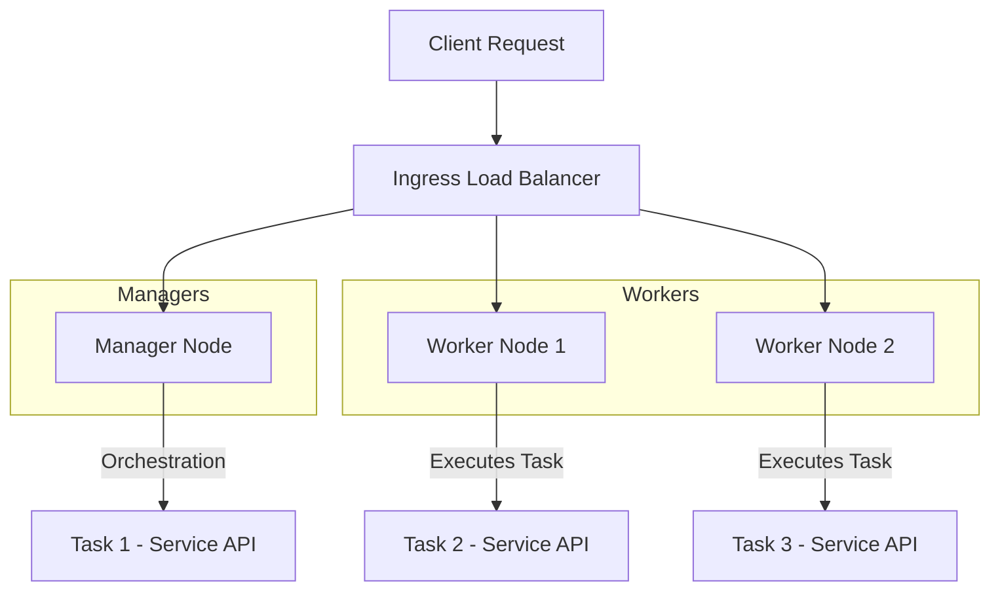

---

## 📌 جمع‌بندی

| مفهوم              | توضیح                                        | مثال واقعی                      |
| ------------------ | -------------------------------------------- | ------------------------------- |
| **Swarm**          | خوشه‌ای از Docker Hostها برای اجرای سرویس‌ها | وب‌سایت فروش آنلاین چندسرویسی   |
| **Manager Node**   | هماهنگ‌کننده وظایف و حفظ وضعیت مطلوب         | کنترل Replicaها و Load Balancer |
| **Worker Node**    | اجرای وظایف دریافتی از Manager               | پردازش درخواست کاربران          |
| **Service**        | تعریف وظایف و کانتینرها                      | سرویس API محصول                 |
| **Task**           | واحد اجرایی شامل یک کانتینر                  | اجرای یک Replica از API         |
| **Load Balancing** | توزیع درخواست‌ها بین نودها                   | تقسیم درخواست‌ها بین ۴ سرور API |

---
# Swarm mode


## 📌 معرفی

نسخه‌های فعلی **Docker** شامل **حالت Swarm** هستند که امکان مدیریت بومی یک کلاستر از Docker Engine‌ها را فراهم می‌کنند (که به آن **Swarm** گفته می‌شود).
با استفاده از **Docker CLI** می‌توانید:

* یک Swarm ایجاد کنید.
* سرویس‌های برنامه را روی Swarm مستقر کنید.
* رفتار Swarm را مدیریت کنید.

> **نکته مهم:** حالت جدید **Docker Swarm mode** داخل Docker Engine تعبیه شده است و نباید با **Docker Classic Swarm** (که دیگر توسعه داده نمی‌شود) اشتباه گرفته شود.

---

## ✨ ویژگی‌های کلیدی

### 1. **مدیریت کلاستر یکپارچه با Docker Engine**

* با استفاده از **Docker Engine CLI** می‌توانید یک کلاستر Swarm بسازید و سرویس‌ها را مستقر کنید.
* نیازی به نرم‌افزار ارکستریشن جداگانه ندارید.

🔹 **مثال واقعی:**
یک شرکت SaaS با سه سرور می‌تواند فقط با Docker Engine، کلاستر Swarm خود را بالا بیاورد و سرویس‌های وب، پایگاه داده و پردازش پیام را مدیریت کند.

---

### 2. **طراحی غیرمتمرکز (Decentralized Design)**

* نیازی به تعیین نقش نودها در زمان استقرار نیست؛ Docker Engine این نقش‌ها را در زمان اجرا مشخص می‌کند.
* از یک **ایمیج دیسک واحد** می‌توانید هم نودهای Manager و هم Worker بسازید.

🔹 **مثال:**
تصور کنید برای توسعه و تست، همه نودها از یک Snapshot سرور ساخته شده‌اند و نقش آن‌ها در زمان اجرا تعیین می‌شود.

---

### 3. **مدل سرویس اعلامی (Declarative Service Model)**

* وضعیت مطلوب (Desired State) سرویس‌ها را تعریف می‌کنید.
* مثال: یک اپلیکیشن شامل سرویس Frontend وب، سرویس صف پیام (Message Queue)، و Backend پایگاه داده.

---

### 4. **مقیاس‌پذیری (Scaling)**

* تعداد **Task**‌های هر سرویس را مشخص می‌کنید.
* در زمان افزایش یا کاهش مقیاس، Swarm Manager به صورت خودکار Taskها را اضافه یا حذف می‌کند.

🔹 **مثال:**
یک سرویس API از ۳ Replica به ۶ Replica افزایش می‌یابد تا ترافیک بیشتر را پاسخ دهد.

---

### 5. **تطبیق وضعیت مطلوب (Desired State Reconciliation)**

* Manager همیشه وضعیت واقعی کلاستر را با وضعیت مطلوب مقایسه می‌کند.
* اگر نودی که بخشی از Replicaها را اجرا می‌کند از کار بیفتد، Manager نسخه‌های جایگزین را روی نودهای سالم ایجاد می‌کند.

---

### 6. **شبکه چند‌میزبانه (Multi-host Networking)**

* می‌توانید یک **Overlay Network** برای سرویس‌ها تعیین کنید.
* Swarm Manager به کانتینرها آدرس IP در این شبکه اختصاص می‌دهد.

---

### 7. **کشف سرویس (Service Discovery)**

* هر سرویس یک نام DNS منحصربه‌فرد دریافت می‌کند.
* Load Balancing داخلی بر اساس نام DNS سرویس انجام می‌شود.

---

### 8. **بالانس بار (Load Balancing)**

* می‌توانید پورت سرویس‌ها را به یک Load Balancer خارجی معرفی کنید.
* به‌صورت داخلی، Swarm نحوه توزیع کانتینرهای سرویس بین نودها را کنترل می‌کند.

---

### 9. **امنیت پیش‌فرض (Secure by Default)**

* همه نودها از TLS Mutual Authentication و رمزنگاری برای ارتباطات استفاده می‌کنند.
* امکان استفاده از **Self-signed Certificate** یا **Custom Root CA** وجود دارد.

---

### 10. **به‌روزرسانی تدریجی (Rolling Updates)**

* به‌روزرسانی سرویس‌ها به‌صورت تدریجی روی نودها اعمال می‌شود.
* امکان **Rollback** به نسخه قبلی در صورت بروز مشکل وجود دارد.

🔹 **مثال:**
آپدیت تدریجی نسخه جدید Backend روی ۲۰٪ نودها، بررسی عملکرد، و سپس ادامه انتشار روی باقی نودها.

---

## 📊 نمودار Mermaid – معماری و ویژگی‌های Swarm Mode

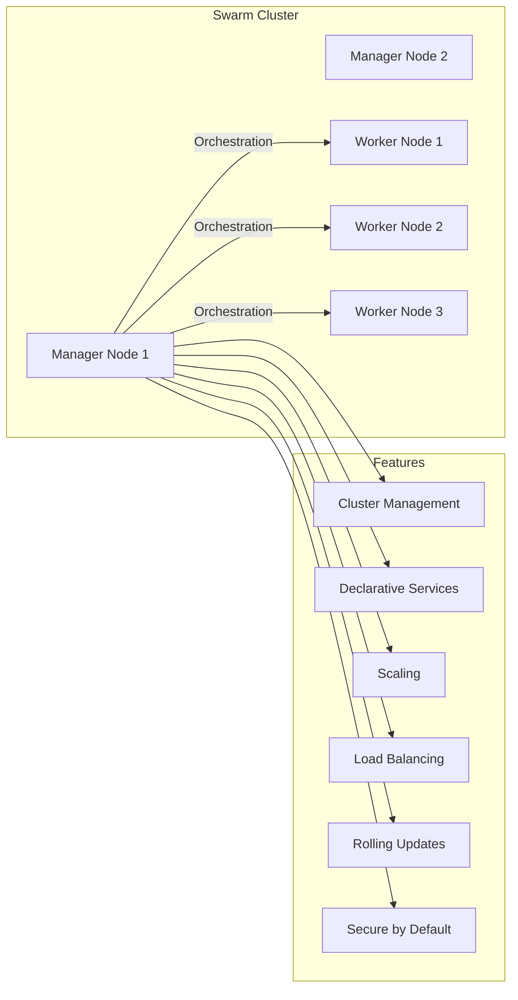

---

## 📌 جمع‌بندی ویژگی‌ها

| ویژگی                            | توضیح                                   | مثال واقعی                              |
| -------------------------------- | --------------------------------------- | --------------------------------------- |
| **Cluster Management**           | ساخت و مدیریت کلاستر داخل Docker Engine | کلاستر ۵ نودی برای سرویس فروشگاه        |
| **Decentralized Design**         | نقش نودها در زمان اجرا تعیین می‌شود     | استفاده از یک ایمیج واحد برای همه نودها |
| **Declarative Model**            | تعریف وضعیت مطلوب سرویس‌ها              | سرویس وب + صف پیام + پایگاه داده        |
| **Scaling**                      | افزایش یا کاهش تعداد Taskها             | افزایش Replica از ۳ به ۶                |
| **Desired State Reconciliation** | جایگزینی خودکار Taskها پس از خرابی      | ایجاد ۲ Replica جایگزین پس از Crash     |
| **Multi-host Networking**        | شبکه Overlay بین چند سرور               | ارتباط سرویس‌ها در دیتاسنتر و Cloud     |
| **Service Discovery**            | تخصیص DNS داخلی و Load Balancing        | `api_service` قابل دسترسی با DNS داخلی  |
| **Load Balancing**               | توزیع درخواست‌ها بین نودها              | استفاده از Nginx یا HAProxy خارجی       |
| **Secure by Default**            | ارتباط امن با TLS                       | تبادل امن داده بین نودهای AWS           |
| **Rolling Updates**              | انتشار تدریجی آپدیت                     | آپدیت نسخه جدید بدون Downtime           |

---

# Getting started with Swarm mode

## 📌 شروع کار با حالت Swarm در Docker

این آموزش شما را با قابلیت‌های حالت **Swarm Mode** در **Docker Engine** آشنا می‌کند.
پیشنهاد می‌شود قبل از شروع، با **[مفاهیم کلیدی](../key-concepts.md)** آشنا شوید.

این آموزش شامل مراحل زیر است:

1. **راه‌اندازی یک کلاستر از Docker Engine‌ها در حالت Swarm**
2. **اضافه کردن نودها به Swarm**
3. **استقرار سرویس‌های برنامه روی Swarm**
4. **مدیریت Swarm پس از راه‌اندازی**

> این مراحل با استفاده از **دستورات CLI در Docker** و اجرای آن‌ها در ترمینال انجام می‌شود.
> اگر تازه‌کار هستید، ابتدا [About Docker Engine](../../_index.md) را مطالعه کنید.

---

## 🛠 پیش‌نیازها

برای اجرای این آموزش به موارد زیر نیاز دارید:

* **سه ماشین لینوکسی** که روی آن‌ها Docker نصب باشد و بتوانند از طریق شبکه با هم ارتباط برقرار کنند.
* **آدرس IP ماشین Manager**
* **باز بودن پورت‌های مشخص بین ماشین‌ها**

---

### 1. سه ماشین میزبان شبکه‌شده (Three Networked Host Machines)

* می‌تواند ماشین فیزیکی، ماشین مجازی، **Amazon EC2 Instance** یا هر سرویس دیگری باشد.
* یکی از این ماشین‌ها نقش **Manager** دارد (با نام `manager1`) و دو ماشین دیگر نقش **Worker** (`worker1` و `worker2`).

> 💡 **نکته:** می‌توانید بسیاری از مراحل را حتی با یک نود انجام دهید (Single-node swarm)، ولی دستورات مربوط به چند نود کار نخواهند کرد.

---

#### نصب Docker Engine روی ماشین‌های لینوکسی

اگر از ماشین‌های لینوکسی (فیزیکی یا ابری) استفاده می‌کنید:

* دستورالعمل نصب لینوکس را در [صفحه نصب Docker](../../install/_index.md) دنبال کنید.
* پس از نصب و راه‌اندازی ۳ ماشین، آماده کار هستید.
* می‌توانید سناریوهای **یک‌نودی** و **چندنودی** را آزمایش کنید.

---

### 2. آدرس IP ماشین Manager

* باید به یک **رابط شبکه (Network Interface)** معتبر در سیستم‌عامل اختصاص داده شده باشد.
* همه نودها باید به این IP وصل شوند.
* توصیه می‌شود از یک **IP ثابت (Static IP)** استفاده کنید.

🔹 **مثال:** در این آموزش، `manager1` دارای IP زیر است:

```
192.168.99.100
```

برای مشاهده IP:

```bash
ifconfig
```

---

### 3. باز بودن پروتکل‌ها و پورت‌ها بین میزبان‌ها

پورت‌های موردنیاز (در برخی سیستم‌ها به‌صورت پیش‌فرض باز هستند):

| پورت / پروتکل   | کاربرد                      |
| --------------- | --------------------------- |
| `2377/TCP`      | ارتباط بین نودهای Manager   |
| `7946/TCP, UDP` | کشف نودها در شبکه Overlay   |
| `4789/UDP`      | ترافیک شبکه Overlay (VXLAN) |

> اگر از شبکه Overlay با رمزگذاری (`--opt encrypted`) استفاده می‌کنید، باید **پروتکل IP شماره 50 (IPSec ESP)** نیز باز باشد.

---

### نکات امنیتی پورت 4789 (VXLAN)

* این پورت باید فقط به **شبکه‌های مورد اعتماد** باز باشد.
* هرگز آن را در **Firewall محیط مرزی (Perimeter Firewall)** به روی اینترنت باز نکنید.
* برای امنیت بیشتر در شبکه‌های غیرقابل اعتماد:

  * **شبکه Ingress پیش‌فرض** را سفارشی‌سازی و رمزگذاری کنید.
  * تنها بسته‌های رمزگذاری‌شده را روی پورت Data Path بپذیرید.

نمونه قانون **iptables**:

```bash
iptables -I INPUT -m udp --dport 4789 -m policy --dir in --pol none -j DROP
```

---

## 📊 نمودار Mermaid – توپولوژی Swarm

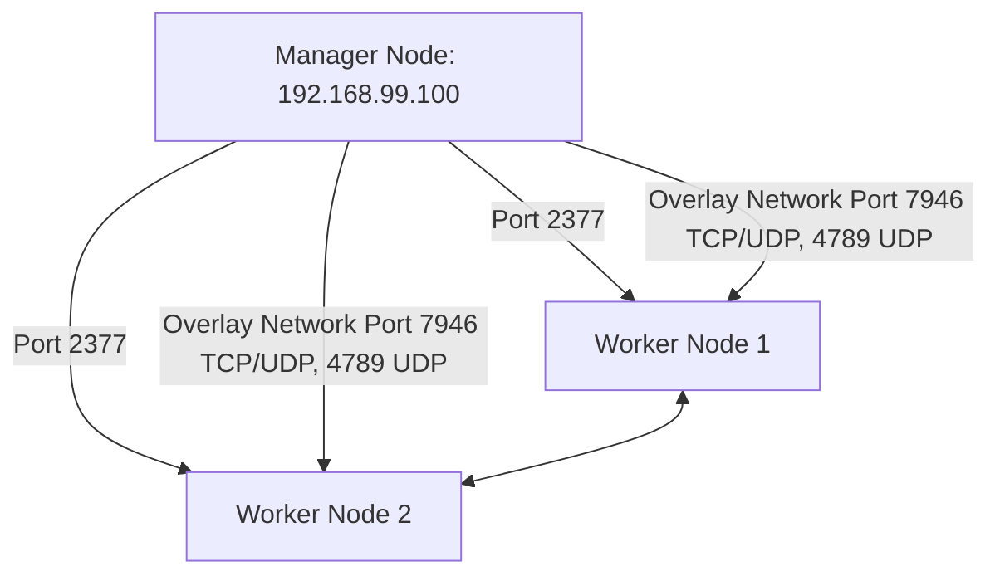

---

## 📌 مثال واقعی

سناریو راه‌اندازی یک Swarm سه‌نودی روی **سه ماشین مجازی Ubuntu** در یک دیتاسنتر خصوصی:

1. روی `manager1`:

```bash
docker swarm init --advertise-addr 192.168.99.100
```

2. خروجی دستور بالا شامل یک **توکن Join** برای Workerها است. روی هر Worker اجرا کنید:

```bash
docker swarm join --token <token> 192.168.99.100:2377
```

3. بررسی وضعیت نودها:

```bash
docker node ls
```

# Create a swarm


## 🚀 ایجاد یک Swarm در Docker

پس از اتمام مراحل [تنظیمات اولیه](index.md)، می‌توانید یک **Swarm** ایجاد کنید.
اطمینان حاصل کنید که **Docker Engine daemon** روی تمام ماشین‌های میزبان شما در حال اجراست.

---

### 1️⃣ اتصال به ماشین Manager

یک ترمینال باز کرده و با استفاده از **SSH** به ماشینی که قرار است نقش **Manager** را داشته باشد وصل شوید.
در این آموزش، ماشین **`manager1`** به‌عنوان Manager استفاده می‌شود.

```bash
ssh user@manager1
```

---

### 2️⃣ اجرای دستور ایجاد Swarm

برای ایجاد Swarm، دستور زیر را اجرا کنید:

```bash
docker swarm init --advertise-addr <MANAGER-IP>
```

در این مثال، دستور به این شکل است:

```bash
docker swarm init --advertise-addr 192.168.99.100
```

📌 **خروجی نمونه:**

```
Swarm initialized: current node (dxn1zf6l61qsb1josjja83ngz) is now a manager.

To add a worker to this swarm, run the following command:

    docker swarm join \
    --token SWMTKN-1-49nj1cmql0jkz5s954yi3oex3nedyz0fb0xx14ie39trti4wxv-8vxv8rssmk743ojnwacrr2e7c \
    192.168.99.100:2377

To add a manager to this swarm, run 'docker swarm join-token manager' and follow the instructions.
```

🔹 **توضیح:**
پارامتر `--advertise-addr` باعث می‌شود نود Manager آدرس IP خودش را به‌صورت `192.168.99.100` به بقیه نودها اعلام کند. سایر نودها باید بتوانند به این IP دسترسی داشته باشند.

🔹 **کلید امنیتی (`--token`)**

* برای اضافه کردن **Worker** یا **Manager** به Swarm استفاده می‌شود.
* نوع نود بر اساس توکن استفاده شده مشخص می‌شود.

---

### 3️⃣ بررسی وضعیت Swarm

برای مشاهده وضعیت فعلی Swarm:

```bash
docker info
```

📌 **خروجی نمونه:**

```
Swarm: active
  NodeID: dxn1zf6l61qsb1josjja83ngz
  Is Manager: true
  Managers: 1
  Nodes: 1
```

این خروجی نشان می‌دهد که Swarm فعال است و این نود نقش **Manager** دارد.

---

### 4️⃣ مشاهده لیست نودها

برای مشاهده اطلاعات نودهای موجود در Swarm:

```bash
docker node ls
```

📌 **خروجی نمونه:**

```
ID                           HOSTNAME  STATUS  AVAILABILITY  MANAGER STATUS
dxn1zf6l61qsb1josjja83ngz *  manager1  Ready   Active        Leader
```

🔹 علامت `*` نشان می‌دهد که شما روی همین نود متصل هستید.
🔹 ستون **MANAGER STATUS** مقدار **Leader** را نشان می‌دهد، یعنی این نود نقش لیدر Managerها را دارد.

---

## 📊 نمودار Mermaid – ایجاد Swarm و نقش‌ها

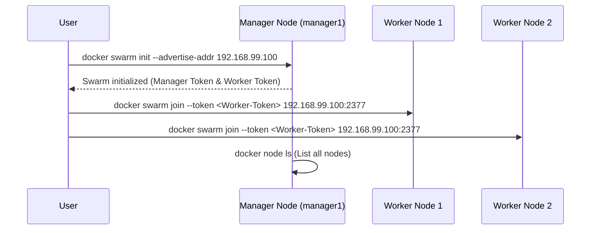

---

## 🎯 نکات کلیدی

| گام              | توضیح                             | نکته امنیتی / عملیاتی                           |
| ---------------- | --------------------------------- | ----------------------------------------------- |
| اتصال به Manager | SSH به ماشین Manager              | مطمئن شوید پورت‌های 22 و Swarm باز هستند        |
| ایجاد Swarm      | `docker swarm init`               | استفاده از IP ثابت برای جلوگیری از مشکلات اتصال |
| اضافه کردن نودها | استفاده از توکن Worker یا Manager | توکن‌ها را امن نگه دارید                        |
| بررسی وضعیت      | `docker info` و `docker node ls`  | مانیتورینگ نودها بعد از Join                    |

---
# Add nodes to the swarm

## 🖥 افزودن نودها به Swarm

پس از اینکه [یک Swarm ایجاد کردید](create-swarm.md) و یک نود **Manager** راه‌اندازی شد، می‌توانید نودهای **Worker** را به آن اضافه کنید.

---

### 1️⃣ اتصال به نود Worker اول

یک ترمینال باز کرده و با **SSH** به ماشینی که می‌خواهید نقش **Worker** داشته باشد وصل شوید.
در این مثال، نام این ماشین `worker1` است:

```bash
ssh user@worker1
```

---

### 2️⃣ اجرای دستور Join برای Worker

دستور **Join** را از خروجی `docker swarm init` (روی Manager) کپی کرده و روی Worker اجرا کنید:

```bash
docker swarm join \
  --token SWMTKN-1-49nj1cmql0jkz5s954yi3oex3nedyz0fb0xx14ie39trti4wxv-8vxv8rssmk743ojnwacrr2e7c \
  192.168.99.100:2377
```

📌 **خروجی موفقیت‌آمیز:**

```
This node joined a swarm as a worker.
```

---

#### 🔹 اگر دستور Join را گم کردید

روی یک **Manager Node** این دستور را اجرا کنید تا توکن و دستور Join برای Worker را ببینید:

```bash
docker swarm join-token worker
```

خروجی مشابه:

```
To add a worker to this swarm, run the following command:

    docker swarm join \
    --token SWMTKN-1-49nj1cmql0jkz5s954yi3oex3nedyz0fb0xx14ie39trti4wxv-8vxv8rssmk743ojnwacrr2e7c \
    192.168.99.100:2377
```

---

### 3️⃣ اتصال به نود Worker دوم

به ماشین دوم (`worker2`) SSH بزنید:

```bash
ssh user@worker2
```

---

### 4️⃣ اجرای دستور Join برای Worker دوم

همان دستور Join را برای اتصال Worker دوم به Swarm اجرا کنید:

```bash
docker swarm join \
  --token SWMTKN-1-49nj1cmql0jkz5s954yi3oex3nedyz0fb0xx14ie39trti4wxv-8vxv8rssmk743ojnwacrr2e7c \
  192.168.99.100:2377
```

📌 **خروجی:**

```
This node joined a swarm as a worker.
```

---

### 5️⃣ بررسی نودهای Swarm از روی Manager

به نود **Manager** برگردید و دستور زیر را اجرا کنید:

```bash
docker node ls
```

📌 **نمونه خروجی:**

```
ID                           HOSTNAME  STATUS  AVAILABILITY  MANAGER STATUS
03g1y59jwfg7cf99w4lt0f662    worker2   Ready   Active
9j68exjopxe7wfl6yuxml7a7j    worker1   Ready   Active
dxn1zf6l61qsb1josjja83ngz *  manager1  Ready   Active        Leader
```

🔹 ستون **MANAGER STATUS** فقط برای نودهای Manager مقدار دارد.
🔹 نودهایی که در این ستون مقدار ندارند، **Worker** هستند.
🔹 دستورات مدیریتی مانند `docker node ls` فقط روی نودهای **Manager** اجرا می‌شوند.

---

## 📊 نمودار Mermaid – اضافه کردن نودهای Worker

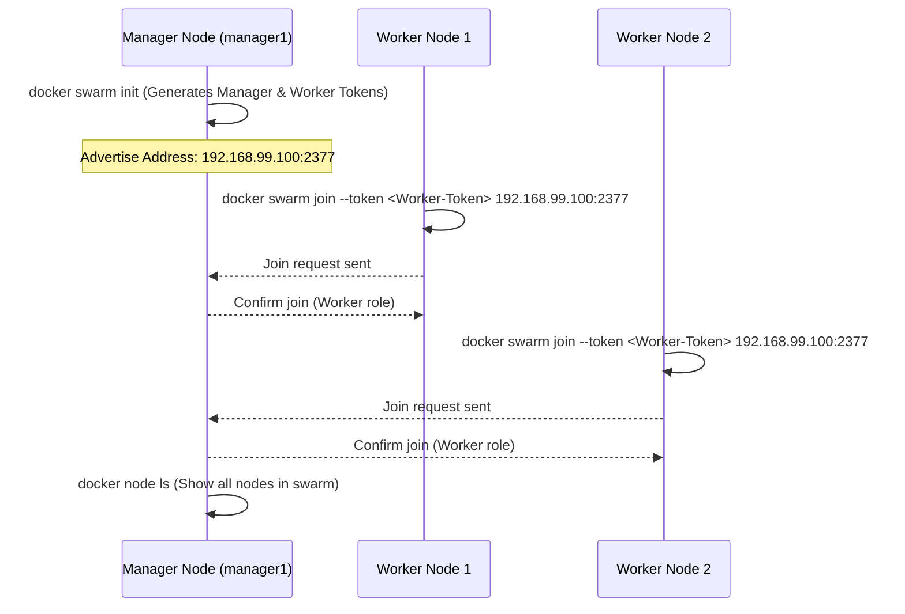

---

## 🎯 نکات کلیدی و امنیتی

| گام         | توضیح                            | نکته امنیتی / عملیاتی                                   |
| ----------- | -------------------------------- | ------------------------------------------------------- |
| دریافت توکن | `docker swarm join-token worker` | توکن‌ها را در محل امن ذخیره کنید                        |
| اجرای Join  | `docker swarm join --token ...`  | IP Manager باید ثابت و قابل دسترس باشد                  |
| بررسی نودها | `docker node ls`                 | این دستور فقط روی Manager اجرا می‌شود                   |
| نقش‌ها      | Worker فقط سرویس اجرا می‌کند     | تغییر نقش از Worker به Manager با `docker node promote` |


# Deploy a service to the swarm

## 🚀 استقرار یک سرویس در Swarm

پس از اینکه [یک Swarm ایجاد کردید](create-swarm.md) و در این آموزش حتی [نودهای Worker را اضافه کردید](add-nodes.md) (که الزامی هم نیست)، می‌توانید سرویس خود را در Swarm مستقر کنید.

---

### 1️⃣ اتصال به نود Manager

یک ترمینال باز کرده و با **SSH** به ماشینی که نقش **Manager** دارد وصل شوید.
در مثال آموزشی، این ماشین با نام **`manager1`** شناخته می‌شود:

```bash
ssh user@manager1
```

---

### 2️⃣ ایجاد سرویس

برای ساخت یک سرویس، دستور زیر را اجرا کنید:

```bash
docker service create --replicas 1 --name helloworld alpine ping docker.com
```

📌 **توضیح پارامترها:**

* `docker service create` → ایجاد یک سرویس جدید در Swarm.
* `--name helloworld` → نام سرویس را **helloworld** تعیین می‌کند.
* `--replicas 1` → وضعیت مطلوب (Desired State) یک نمونه در حال اجرا است.
* `alpine ping docker.com` → سرویس بر اساس ایمیج **Alpine Linux** ساخته می‌شود و دستور `ping docker.com` درون آن اجرا می‌شود.

📌 **نمونه خروجی:**

```
9uk4639qpg7npwf3fn2aasksr
```

این شناسه، **Service ID** شماست.

---

### 3️⃣ مشاهده سرویس‌های در حال اجرا

برای لیست سرویس‌های فعال:

```bash
docker service ls
```

📌 **نمونه خروجی:**

```
ID            NAME        SCALE  IMAGE   COMMAND
9uk4639qpg7n  helloworld  1/1    alpine  ping docker.com
```

---

## 📊 نمودار Mermaid – جریان استقرار سرویس در Swarm

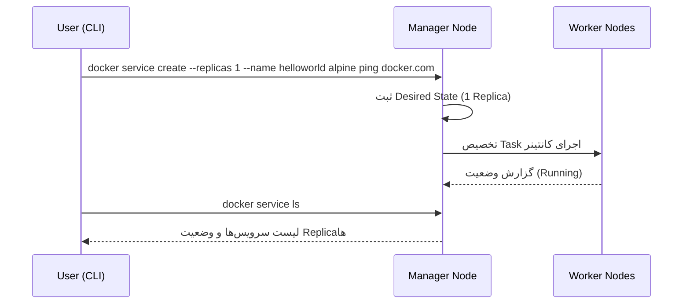

---

## 🎯 نکات کلیدی و عملیاتی

| بخش                       | توضیح                           | نکته مهم                                                |
| ------------------------- | ------------------------------- | ------------------------------------------------------- |
| **Manager Node**          | محل اجرای دستورات مدیریتی Swarm | فقط روی Manager امکان‌پذیر است                          |
| **docker service create** | ایجاد سرویس                     | پارامترهای نام، مقیاس و ایمیج ضروری هستند               |
| **Replicas**              | تعداد نمونه‌های فعال سرویس      | Swarm به‌صورت خودکار تعداد را در حالت مطلوب نگه می‌دارد |
| **docker service ls**     | نمایش سرویس‌ها                  | شامل وضعیت واقعی در مقابل Desired State                 |

---
# Inspect a service on the swarm

## 🔍 بررسی یک سرویس در Swarm

پس از اینکه [یک سرویس را در Swarm مستقر کردید](deploy-service.md)، می‌توانید با استفاده از **Docker CLI** جزئیات مربوط به آن سرویس را ببینید.

---

### 1️⃣ اتصال به نود Manager

اگر هنوز متصل نشده‌اید، به ماشین **Manager** خود وارد شوید.
در این آموزش، ماشین **`manager1`** استفاده می‌شود:

```bash
ssh user@manager1
```

---

### 2️⃣ مشاهده جزئیات سرویس به‌صورت خوانا

برای دیدن جزئیات سرویس در قالبی ساده و قابل خواندن:

```bash
docker service inspect --pretty <SERVICE-ID>
```

📌 برای سرویس `helloworld`:

```bash
docker service inspect --pretty helloworld
```

📌 **نمونه خروجی:**

```
ID:             9uk4639qpg7npwf3fn2aasksr
Name:           helloworld
Service Mode:   REPLICATED
 Replicas:      1
Placement:
UpdateConfig:
 Parallelism:   1
ContainerSpec:
 Image:         alpine
 Args:          ping docker.com
Resources:
Endpoint Mode:  vip
```

💡 **نکته:**
اگر بخواهید خروجی را به فرمت **JSON** ببینید (برای پردازش یا استفاده در اسکریپت‌ها)، `--pretty` را حذف کنید:

```bash
docker service inspect helloworld
```

---

### 3️⃣ مشاهده نودهای میزبان سرویس

برای دیدن اینکه کدام نودها سرویس را اجرا می‌کنند:

```bash
docker service ps <SERVICE-ID>
```

📌 برای مثال:

```bash
docker service ps helloworld
```

📌 **نمونه خروجی:**

```
NAME                                    IMAGE   NODE     DESIRED STATE  CURRENT STATE           ERROR  PORTS
helloworld.1.8p1vev3fq5zm0mi8g0as41w35  alpine  worker2  Running        Running 3 minutes
```

🔹 در این مثال، تنها Replica سرویس `helloworld` روی **`worker2`** در حال اجراست.
🔹 به‌طور پیش‌فرض، **Manager Node** نیز می‌تواند مانند Worker سرویس اجرا کند.

---

### 4️⃣ مشاهده جزئیات کانتینر سرویس

روی نودی که Task در آن اجرا می‌شود، دستور زیر را بزنید:

```bash
docker ps
```

📌 اگر سرویس روی نود دیگری اجرا می‌شود، باید به آن نود SSH کنید.
برای مثال، روی `worker2`:

```bash
ssh user@worker2
docker ps
```

📌 **نمونه خروجی:**

```
CONTAINER ID        IMAGE               COMMAND             CREATED             STATUS              PORTS               NAMES
e609dde94e47        alpine:latest       "ping docker.com"   3 minutes ago       Up 3 minutes                            helloworld.1.8p1vev3fq5zm0mi8g0as41w35
```

---

## 📊 نمودار Mermaid – جریان بررسی سرویس در Swarm

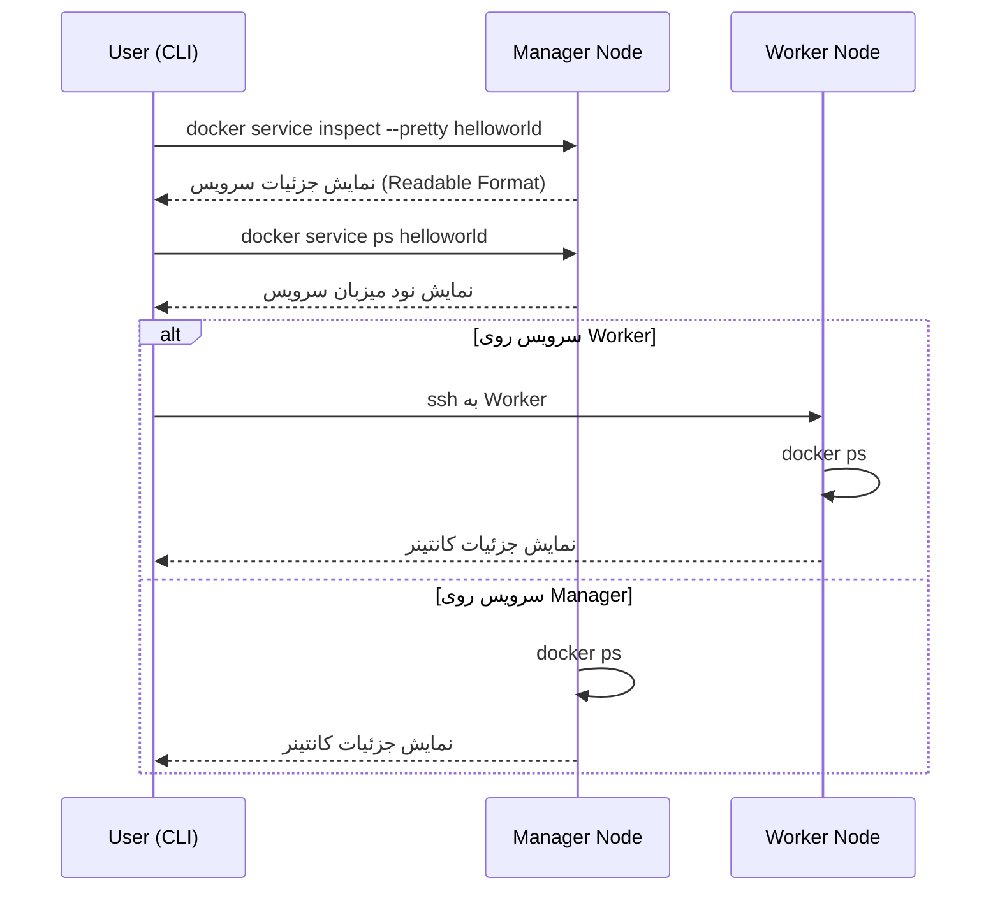

---

## 🎯 نکات کلیدی

| دستور                             | کاربرد                    | نکته مهم                                      |
| --------------------------------- | ------------------------- | --------------------------------------------- |
| `docker service inspect --pretty` | نمایش خوانای مشخصات سرویس | مناسب مانیتورینگ دستی                         |
| `docker service inspect`          | نمایش JSON مشخصات سرویس   | مناسب پردازش خودکار و اسکریپت‌ها              |
| `docker service ps`               | نمایش محل اجرای Replicaها | بررسی هماهنگی Desired State و Current State   |
| `docker ps`                       | نمایش جزئیات کانتینر      | باید روی همان نودی اجرا شود که Task در آن است |

---

# Scale the service in the swarm

## 📈 مقیاس‌دهی (Scaling) سرویس در Swarm

وقتی یک [سرویس را در Swarm مستقر کردید](deploy-service.md)، می‌توانید با استفاده از **Docker CLI** تعداد کانتینرهای آن سرویس را تغییر دهید.
در معماری Swarm، **هر کانتینر یک Task محسوب می‌شود**.

---

### 1️⃣ اتصال به نود Manager

اگر هنوز متصل نشده‌اید، به نود **Manager** وارد شوید.
در مثال آموزشی، این ماشین با نام **`manager1`** استفاده می‌شود:

```bash
ssh user@manager1
```

---

### 2️⃣ تغییر وضعیت مطلوب (Desired State) سرویس

برای تغییر تعداد Replicaها (Tasks)، دستور زیر را اجرا کنید:

```bash
docker service scale <SERVICE-ID>=<NUMBER-OF-TASKS>
```

📌 مثال:
برای افزایش سرویس `helloworld` از **۱** به **۵ Replica**:

```bash
docker service scale helloworld=5
```

📌 **خروجی:**

```
helloworld scaled to 5
```

---

### 3️⃣ مشاهده لیست Tasks به‌روزشده

برای دیدن محل اجرای Replicaها:

```bash
docker service ps helloworld
```

📌 **نمونه خروجی:**

```
NAME                                    IMAGE   NODE      DESIRED STATE  CURRENT STATE
helloworld.1.8p1vev3fq5zm0mi8g0as41w35  alpine  worker2   Running        Running 7 minutes
helloworld.2.c7a7tcdq5s0uk3qr88mf8xco6  alpine  worker1   Running        Running 24 seconds
helloworld.3.6crl09vdcalvtfehfh69ogfb1  alpine  worker1   Running        Running 24 seconds
helloworld.4.auky6trawmdlcne8ad8phb0f1  alpine  manager1  Running        Running 24 seconds
helloworld.5.ba19kca06l18zujfwxyc5lkyn  alpine  worker2   Running        Running 24 seconds
```

🔹 Swarm برای رسیدن به ۵ Replica، **۴ Task جدید** ایجاد کرده است.
🔹 این Tasks بین ۳ نود Swarm توزیع شده‌اند (حتی Manager هم یک Task اجرا می‌کند).

---

### 4️⃣ بررسی کانتینرهای یک نود خاص

برای دیدن کانتینرهای در حال اجرا روی نودی که به آن متصل هستید:

```bash
docker ps
```

📌 روی `manager1`:

```
CONTAINER ID        IMAGE               COMMAND             CREATED             STATUS              PORTS               NAMES
528d68040f95        alpine:latest       "ping docker.com"   About a minute ago   Up About a minute                       helloworld.4.auky6trawmdlcne8ad8phb0f1
```

اگر می‌خواهید کانتینرهای نودهای دیگر را ببینید، با **SSH** به آن‌ها وصل شوید و همان دستور را اجرا کنید.

---

## 📊 نمودار Mermaid – جریان Scaling سرویس در Swarm

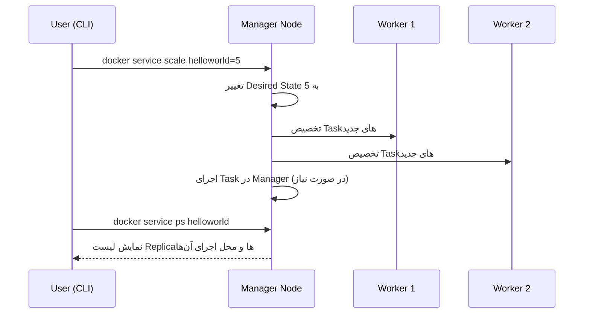

---

## 🎯 نکات کلیدی

| دستور                  | کاربرد                     | نکته مهم                                       |
| ---------------------- | -------------------------- | ---------------------------------------------- |
| `docker service scale` | تغییر تعداد Replicaها      | فقط روی Manager اجرا می‌شود                    |
| `docker service ps`    | نمایش لیست Tasks           | وضعیت **Desired** و **Current** را مقایسه کنید |
| `docker ps`            | نمایش کانتینرها روی یک نود | باید روی همان نود اجرا شود                     |

---

# Delete the service running on the swarm

## 🗑 حذف سرویس در Swarm

اکنون که مراحل آموزش با سرویس `helloworld` به پایان رسیده، می‌توانیم آن را از Swarm حذف کنیم.

---

### 1️⃣ اتصال به نود Manager

اگر هنوز متصل نشده‌اید، به نود **Manager** وارد شوید.
در مثال آموزشی، این ماشین با نام **`manager1`** استفاده می‌شود:

```bash
ssh user@manager1
```

---

### 2️⃣ اجرای دستور حذف سرویس

برای حذف سرویس `helloworld`:

```bash
docker service rm helloworld
```

📌 **نمونه خروجی:**

```
helloworld
```

---

### 3️⃣ اطمینان از حذف سرویس

برای بررسی اینکه سرویس واقعاً حذف شده است:

```bash
docker service inspect helloworld
```

📌 **خروجی مورد انتظار:**

```
[]
Status: Error: no such service: helloworld, Code: 1
```

این پیام نشان می‌دهد که سرویس دیگر در Swarm وجود ندارد.

---

### 4️⃣ بررسی پاک شدن کانتینرها

هرچند سرویس حذف شده، ممکن است **Task Containerها** چند ثانیه طول بکشند تا به‌طور کامل پاک شوند.
برای بررسی روی نودها:

```bash
docker ps
```

📌 ممکن است ابتدا این وضعیت را ببینید:

```
CONTAINER ID        IMAGE               COMMAND             CREATED             STATUS              PORTS   NAMES
db1651f50347        alpine:latest       "ping docker.com"   44 minutes ago      Up 46 seconds       ...     helloworld.5....
43bf6e532a92        alpine:latest       "ping docker.com"   44 minutes ago      Up 46 seconds       ...     helloworld.3....
...
```

چند لحظه بعد دوباره اجرا کنید:

```
CONTAINER ID   IMAGE   COMMAND   CREATED   STATUS   PORTS   NAMES
```

لیست خالی نشان می‌دهد که کانتینرها هم پاک شده‌اند.

---

## 📊 نمودار Mermaid – جریان حذف سرویس در Swarm

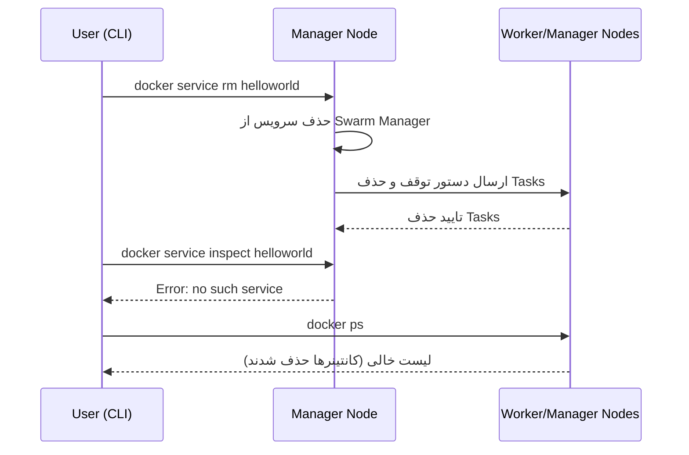

---

## 🎯 نکات کلیدی

| دستور                      | کاربرد                  | نکته مهم                             |
| -------------------------- | ----------------------- | ------------------------------------ |
| `docker service rm <name>` | حذف سرویس از Swarm      | فقط روی Manager اجرا می‌شود          |
| `docker service inspect`   | بررسی وضعیت سرویس       | خطای `no such service` یعنی حذف موفق |
| `docker ps`                | بررسی پاک شدن کانتینرها | ممکن است چند ثانیه زمان ببرد         |

# Apply rolling updates to a service


## 🔄 اجرای Rolling Update روی سرویس در Swarm

در مراحل قبلی، شما یک سرویس را [مقیاس‌دهی کردید](scale-service.md).
در این بخش، ابتدا یک سرویس بر اساس ایمیج `redis:7.4.0` مستقر می‌کنیم و سپس آن را به نسخه `redis:7.4.1` ارتقا می‌دهیم، به‌طوری‌که بروزرسانی به صورت مرحله‌ای (Rolling) و با تأخیر مشخص بین هر Replica انجام شود.

---

### 1️⃣ اتصال به نود Manager

اگر هنوز متصل نشده‌اید، به ماشین **Manager** وصل شوید.
در مثال آموزشی، این ماشین **`manager1`** است:

```bash
ssh user@manager1
```

---

### 2️⃣ استقرار سرویس Redis با سیاست Rolling Update

برای ایجاد سرویس Redis با ۳ Replica و تأخیر ۱۰ ثانیه بین هر بروزرسانی:

```bash
docker service create \
  --replicas 3 \
  --name redis \
  --update-delay 10s \
  redis:7.4.0
```

📌 **توضیح پارامترها:**

* `--replicas 3` → تعداد Replicaها.
* `--update-delay 10s` → فاصله زمانی بین بروزرسانی هر Task.
* می‌توانید زمان را ترکیبی وارد کنید (مثلاً `10m30s`).
* `--update-parallelism` → تعداد Taskهایی که همزمان بروزرسانی می‌شوند (پیش‌فرض 1).
* `--update-failure-action` → مشخص می‌کند در صورت شکست بروزرسانی چه اتفاقی بیفتد (`pause`، `continue` یا `rollback`).

---

### 3️⃣ بررسی سرویس

برای مشاهده جزئیات سرویس:

```bash
docker service inspect --pretty redis
```

📌 خروجی نمونه:

```
Name:           redis
Replicas:       3
UpdateConfig:
 Parallelism:   1
 Delay:         10s
ContainerSpec:
 Image:         redis:7.4.0
```

---

### 4️⃣ به‌روزرسانی Rolling به نسخه جدید

برای ارتقاء به نسخه `redis:7.4.1`:

```bash
docker service update --image redis:7.4.1 redis
```

📌 روند پیش‌فرض Scheduler:

1. توقف اولین Task.
2. راه‌اندازی Task با نسخه جدید.
3. اگر Task به حالت RUNNING رفت، بعد از Delay مشخص به سراغ Task بعدی می‌رود.
4. اگر Task به حالت FAILED رفت، بروزرسانی متوقف می‌شود.

---

### 5️⃣ بررسی نسخه جدید در Desired State

```bash
docker service inspect --pretty redis
```

📌 خروجی پس از بروزرسانی موفق:

```
Image:         redis:7.4.1
```

📌 اگر بروزرسانی متوقف شود:

```
Update status:
 State:    paused
 Message:  update paused due to failure...
```

برای ادامه بروزرسانی:

```bash
docker service update redis
```

---

### 6️⃣ مشاهده فرآیند Rolling Update

```bash
docker service ps redis
```

📌 نمونه خروجی:

```
redis.1   redis:7.4.1  worker1   Running
 \_ redis.1  redis:7.4.0  worker2   Shutdown
redis.2   redis:7.4.1  worker2   Running
 \_ redis.2  redis:7.4.0  worker1   Shutdown
redis.3   redis:7.4.1  worker1   Running
 \_ redis.3  redis:7.4.0  manager1  Shutdown
```

🔹 تا قبل از اتمام بروزرسانی، بعضی Replicaها نسخه قدیم و برخی نسخه جدید را اجرا می‌کنند.

---

## 📊 نمودار Mermaid – جریان Rolling Update

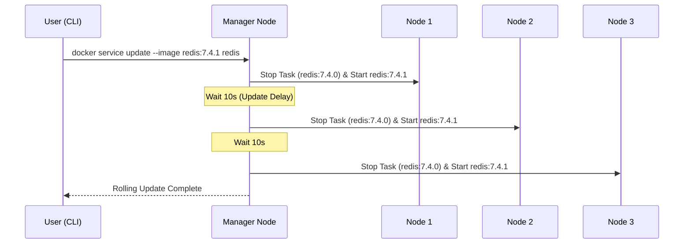

---

## 🎯 نکات کلیدی

| گزینه                     | توضیح                                      | مثال                            |
| ------------------------- | ------------------------------------------ | ------------------------------- |
| `--update-delay`          | زمان بین بروزرسانی Taskها                  | `10s` یا `1m30s`                |
| `--update-parallelism`    | تعداد Taskهایی که همزمان بروزرسانی می‌شوند | `--update-parallelism 2`        |
| `--update-failure-action` | رفتار در شکست بروزرسانی                    | `pause`, `continue`, `rollback` |
| `docker service ps`       | مشاهده وضعیت هر Replica                    | بررسی تفاوت نسخه قدیم و جدید    |


# Drain a node on the swarm

## 🛑 قرار دادن یک نود در حالت Drain در Swarm

در مراحل قبل، همه نودهای شما در وضعیت **Active** بودند.
وقتی یک نود **Active** است، Swarm Manager می‌تواند به آن Task اختصاص دهد.
اما گاهی (مثل زمان‌های تعمیرات یا نگهداری) لازم است نودی را در وضعیت **Drain** قرار دهید.

حالت **Drain** باعث می‌شود:

* نود هیچ Task جدیدی از سرویس‌های Swarm دریافت نکند.
* Taskهای فعلی روی آن متوقف شوند و روی نودهای Active دیگر اجرا شوند.

> ⚠️ **مهم:**
> حالت Drain فقط روی **Taskهای سرویس‌های Swarm** اثر دارد.
> کانتینرهای مستقل (ایجاد شده با `docker run`، `docker compose up` یا API) حذف یا متوقف نمی‌شوند.

---

## 1️⃣ اتصال به نود Manager

اگر هنوز به نود Manager متصل نیستید، وارد شوید.
در این آموزش، نود Manager با نام **`manager1`** است:

```bash
ssh کاربر@manager1
```

---

## 2️⃣ بررسی وضعیت فعلی همه نودها

برای دیدن وضعیت همه نودها:

```bash
docker node ls
```

نمونه خروجی:

```
ID                           HOSTNAME  STATUS  AVAILABILITY  MANAGER STATUS
1bcef6utixb0l0ca7gxuivsj0    worker2   Ready   Active
38ciaotwjuritcdtn9npbnkuz    worker1   Ready   Active
e216jshn25ckzbvmwlnh5jr3g *  manager1  Ready   Active        Leader
```

> همه نودها در حالت Active هستند.

---

## 3️⃣ اجرای سرویس Redis (در صورت اجرا نشدن قبلی)

اگر سرویس Redis از مرحله [Rolling Update](rolling-update.md) هنوز فعال نیست، آن را اجرا کنید:

```bash
docker service create --replicas 3 --name redis --update-delay 10s redis:7.4.0
```

نمونه خروجی:

```
c5uo6kdmzpon37mgj9mwglcfw
```

---

## 4️⃣ مشاهده توزیع Taskها

برای دیدن اینکه Taskهای سرویس بین چه نودهایی توزیع شده‌اند:

```bash
docker service ps redis
```

نمونه خروجی:

```
NAME                               IMAGE        NODE     DESIRED STATE  CURRENT STATE
redis.1.7q92v0nr1hcgts2amcjyqg3pq  redis:7.4.0  manager1 Running        Running 26 seconds
redis.2.7h2l8h3q3wqy5f66hlv9ddmi6  redis:7.4.0  worker1  Running        Running 26 seconds
redis.3.9bg7cezvedmkgg6c8yzvbhwsd  redis:7.4.0  worker2  Running        Running 26 seconds
```

> اینجا هر نود یک Task دریافت کرده است.

---

## 5️⃣ تغییر وضعیت یک نود به Drain

برای قرار دادن `worker1` در حالت Drain:

```bash
docker node update --availability drain worker1
```

نمونه خروجی:

```
worker1
```

---

## 6️⃣ بررسی وضعیت نود Drain شده

برای دیدن جزئیات:

```bash
docker node inspect --pretty worker1
```

نمونه خروجی:

```
ID:                  38ciaotwjuritcdtn9npbnkuz
Hostname:            worker1
Status:
 State:              Ready
 Availability:       Drain
...بخش‌های دیگر...
```

> حالا Availability برابر Drain است.

---

## 7️⃣ مشاهده جابه‌جایی Taskها

وقتی یک نود Drain شود، Swarm Taskهای آن را روی نودهای Active اجرا می‌کند.

```bash
docker service ps redis
```

نمونه خروجی:

```
NAME                                    IMAGE        NODE      DESIRED STATE  CURRENT STATE           ERROR
redis.1.7q92v0nr1hcgts2amcjyqg3pq       redis:7.4.0  manager1  Running        Running 4 minutes
redis.2.b4hovzed7id8irg1to42egue8       redis:7.4.0  worker2   Running        Running About a minute
 \_ redis.2.7h2l8h3q3wqy5f66hlv9ddmi6   redis:7.4.0  worker1   Shutdown       Shutdown 2 minutes ago
redis.3.9bg7cezvedmkgg6c8yzvbhwsd       redis:7.4.0  worker2   Running        Running 4 minutes
```

> Task شماره 2 که قبلاً روی worker1 بود، روی worker2 راه‌اندازی شده است.

---

## 8️⃣ بازگرداندن نود به حالت Active

برای فعال‌سازی دوباره worker1:

```bash
docker node update --availability active worker1
```

نمونه خروجی:

```
worker1
```

---

## 9️⃣ بررسی تغییر وضعیت

```bash
docker node inspect --pretty worker1
```

نمونه خروجی:

```
ID:                  38ciaotwjuritcdtn9npbnkuz
Hostname:            worker1
Status:
 State:              Ready
 Availability:       Active
...بخش‌های دیگر...
```

> حالا worker1 دوباره می‌تواند Taskهای جدید بگیرد، چه در مقیاس‌گذاری، چه Rolling Update و چه در جایگزینی Taskهای خراب.

---

## 📊 نمودار Mermaid – فرآیند Drain و Active

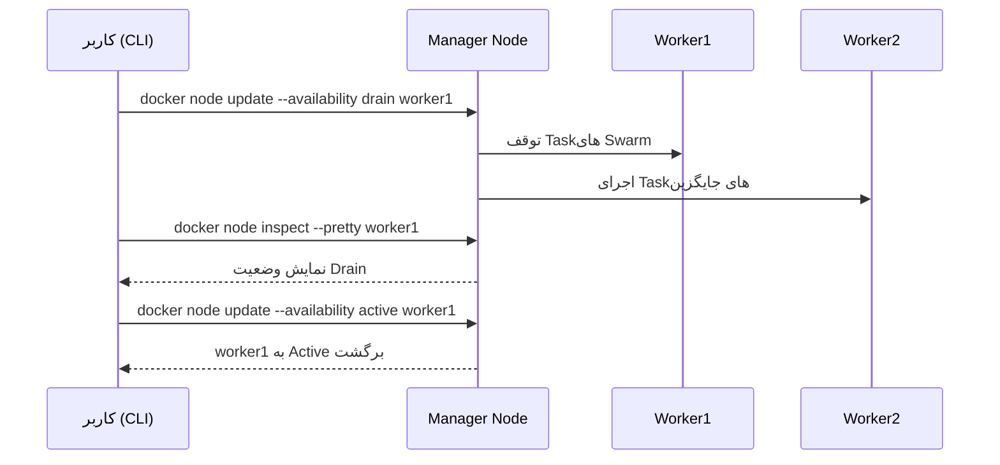

---

## 🎯 نکات کلیدی

| دستور                                      | کاربرد                            | نکته مهم                                    |
| ------------------------------------------ | --------------------------------- | ------------------------------------------- |
| `docker node update --availability drain`  | غیرفعال کردن نود برای دریافت Task | فقط Taskهای سرویس‌های Swarm جابه‌جا می‌شوند |
| `docker node inspect --pretty`             | بررسی وضعیت نود                   | Availability باید Drain یا Active باشد      |
| `docker node update --availability active` | فعال‌سازی مجدد نود                | بعد از فعال‌سازی، نود آماده دریافت Task است |
