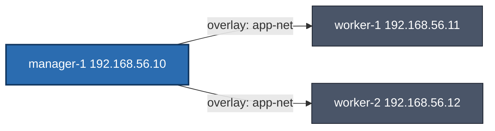

<div dir='rtl'>

## Docker Swarm + Vagrant


### طرح کلان و معماری

## هدف

1. ساخت لَب سه‌ماشینه با Vagrant برای تمرین Swarm
2. توسعه‌ی یک Todo Service با FastAPI + PostgreSQL
3. دیپلوی سرویس به‌صورت Stack روی Docker Swarm با مقیاس‌پذیری، Healthcheck و Rolling Update
4. مدیریت ساده (Portainer اختیاری در فاز پایانی)

## توپولوژی لَب (Swarm)



* شبکه Host-Only: `192.168.56.0/24`
* Swarm init روی **manager-1**، Workers به کلاستر جوین می‌شوند
* **Overlay network** برای سرویس‌ها: `app-net`
* **PostgreSQL** با Volume پایدار (روی manager برای سادگی لَب)
* **API** (FastAPI) با ۳ Replica و Rolling update

---

# ساختار پوشه‌ها (Repository Layout)

</div>

```
swarm-todo-lab/
├─ Vagrantfile
├─ provision/
│  ├─ install_docker.sh          # نصب Docker و compose-plugin
│  ├─ manager.sh                 # init swarm + ساخت overlay + ذخیره توکن
│  └─ worker.sh                  # join به کلاستر
├─ scripts/
│  ├─ deploy_stack.sh            # ساخت secret و deploy stack
│  └─ remove_stack.sh            # حذف stack و پاکسازی
├─ app/
│  ├─ backend/
│  │  ├─ app/
│  │  │  ├─ __init__.py
│  │  │  ├─ main.py              # FastAPI entrypoint
│  │  │  ├─ database.py          # SQLAlchemy Session
│  │  │  ├─ models.py            # Todo model
│  │  │  ├─ schemas.py           # Pydantic DTOs
│  │  │  ├─ crud.py              # عملیات CRUD
│  │  │  └─ routers/
│  │  │     ├─ __init__.py
│  │  │     └─ todos.py          # مسیرهای /todos
│  │  ├─ Dockerfile
│  │  └─ requirements.txt
│  ├─ compose.dev.yml            # اجرا در حالت dev (بدون Swarm)
│  └─ stack.yml                  # فایل stack برای Swarm
├─ .env                          # متغیرهای dev
├─ .env.swarm                    # متغیرهای deploy روی Swarm
├─ Makefile                      # شورتکات‌های اجرایی
└─ README.md
```
<div dir='rtl'>

---

# فازبندی اجرای پروژه

#### فاز 0 — پیش‌نیاز و Bootstrap

**هدف:** آماده‌سازی مخزن و ابزارها
**ابزار لازم روی سیستم شما:**

* VirtualBox (آخرین نسخه پایدار)
* Vagrant (پیشنهادی: 2.4+)
* Git

**خروجی/مسیرها که تکمیل می‌شود:**

* ساختار پوشه‌ها + فایل‌های خالی بالا
* `README.md` اولیه با دستورات

---

#### فاز 1 — ساخت لَب با Vagrant و راه‌اندازی Swarm

**هدف:** سه VM (۱ مدیر + ۲ ورکر) و تشکیل کلاستر Swarm

**فایل‌ها/محتوا (پیشنهاد نهایی برای تأیید):**

---

#### فاز 2 — توسعه Todo API (FastAPI + SQLAlchemy)

**هدف:** پیاده‌سازی CRUD کامل، لایه‌بندی ساده و آماده‌سازی برای کانتینرسازی


#### فاز 3 — اجرای Dev (بدون Swarm) برای تست سریع


#### فاز 4 — آماده‌سازی Stack برای Swarm و دیپلوی


> نکته: برای استفاده از secret داخل env، این ترفند `$(cat /run/secrets/pg_password)` با shell-expansion کار می‌کند چون Swarm به صورت مستقیم secrets را به env تزریق نمی‌کند. در صورت نیاز، entrypoint سفارشی هم می‌توانیم بذاریم. (اگر ترجیح بدی، از متغیر `POSTGRES_PASSWORD_FILE` فقط در db استفاده کنیم و در API از DSN بدون پسورد یا با user/host trust در شبکه داخلی استفاده کنیم—اما این رو فعلاً ساده و امن نگه می‌داریم.)


#### فاز 5 — مقیاس‌پذیری، به‌روزرسانی و مدیریت

**موارد تکمیلی این فاز:**

* افزایش/کاهش Replicaها: `docker service scale todo_api=5`
* تست Rolling Update با تغییر نسخه ایمیج
* محدودیت منابع (CPU/Memory) که در stack.yml گذاشته‌ایم
* (اختیاری) افزودن **Portainer** برای مدیریت آسان Swarm:

  * یک سرویس ساده Portainer روی manager با Volume جهت ذخیره داده‌ها

---

# جدول فازها و فایل‌های هر فاز

| فاز | هدف          | فایل‌ها/مسیرهایی که ساخته یا ویرایش می‌شوند              | خروجی قابل تست                         |
| --- | ------------ | -------------------------------------------------------- | -------------------------------------- |
| 0   | Bootstrap    | اسکلت پوشه‌ها، README, .env نمونه                        | —                                      |
| 1   | لَب و Swarm  | `Vagrantfile`, `provision/*`                             | `docker node ls` در manager            |
| 2   | Backend CRUD | `app/backend/app/*`, `requirements.txt`, `Dockerfile`    | اجرای محلی با Uvicorn (پایه)           |
| 3   | Dev Compose  | `app/compose.dev.yml`, `.env`                            | `http://localhost:8000/healthz` و CRUD |
| 4   | Swarm Stack  | `app/stack.yml`, `.env.swarm`, `scripts/deploy_stack.sh` | `http://192.168.56.10:8080`            |
| 5   | Scale/Update | تغییر `stack.yml`، دستورات scale/update                  | Rolling Update + Scale                 |

## 🎯 هدف فاز ۱

* ساخت یک لَب سه‌ماشینه با **Vagrant + VirtualBox**
* نصب Docker Engine و پلاگین Compose روی هر نود
* راه‌اندازی یک کلاستر **Docker Swarm**
* ایجاد یک شبکه Overlay مشترک به نام `app-net` برای سرویس‌ها

---

## 📂 ساختار فایل‌ها و مسیرها

```
swarm-todo-lab/
├─ Vagrantfile
├─ provision/
│  ├─ install_docker.sh     # نصب Docker روی هر نود (سازگار با Debian/Ubuntu)
│  ├─ manager.sh            # init Swarm روی مدیر + ساخت شبکه app-net + ذخیره توکن جوین
│  └─ worker.sh             # join به کلاستر با استفاده از توکن ذخیره‌شده
```

---

## 📜 محتوای فایل‌ها

### **`Vagrantfile`**


</div>

```ruby
# -*- mode: ruby -*-
Vagrant.configure("2") do |config|
  config.vm.box = "debian/bullseye64"

  NODES = [
    {name: "manager-1", ip: "192.168.100.7", mem: 2048, cpus: 2, role: "manager"},
    {name: "worker-1",  ip: "192.168.100.8", mem: 1536, cpus: 2, role: "worker"},
    {name: "worker-2",  ip: "192.168.100.9", mem: 1536, cpus: 2, role: "worker"}
  ]

  NODES.each do |node|
    config.vm.define node[:name] do |n|
      n.vm.hostname = node[:name]
      n.vm.network "private_network", ip: node[:ip]
      n.vm.provider "virtualbox" do |vb|
        vb.memory = node[:mem]
        vb.cpus = node[:cpus]
      end

      n.vm.provision "shell", path: "provision/install_docker.sh"

      if node[:role] == "manager"
        n.vm.provision "shell", path: "provision/manager.sh"
      else
        n.vm.provision "shell", path: "provision/worker.sh"
      end
    end
  end
end
```

---

### **`provision/install_docker.sh`**  *(سازگار با Debian و Ubuntu)*

```bash
#!/usr/bin/env bash
set -euo pipefail

# بهبود پایداری apt
cat >/etc/apt/apt.conf.d/99retries <<'CFG'
Acquire::Retries "5";
Acquire::http::Timeout "30";
Acquire::https::Timeout "30";
CFG

# تشخیص توزیع و کدنام
. /etc/os-release
OS_ID="${ID:-}"
CODENAME="${VERSION_CODENAME:-}"

if [[ -z "${OS_ID}" || -z "${CODENAME}" ]]; then
  echo "Cannot detect OS or codename from /etc/os-release"
  exit 1
fi

# پاکسازی لیست‌های قبلی Docker (در صورت وجود)
rm -f /etc/apt/sources.list.d/docker.list || true
install -m 0755 -d /etc/apt/keyrings

# نصب پیش‌نیازها
apt-get update -y || true
apt-get install -y --no-install-recommends ca-certificates curl gnupg lsb-release apt-transport-https

# اضافه کردن کلید Docker
curl -fsSL https://download.docker.com/linux/${OS_ID}/gpg | gpg --yes --dearmor -o /etc/apt/keyrings/docker.gpg
chmod a+r /etc/apt/keyrings/docker.gpg

# اضافه کردن مخزن Docker
case "${OS_ID}" in
  ubuntu)
    echo "deb [arch=$(dpkg --print-architecture) signed-by=/etc/apt/keyrings/docker.gpg] \
https://download.docker.com/linux/ubuntu ${CODENAME} stable" > /etc/apt/sources.list.d/docker.list
    ;;
  debian)
    echo "deb [arch=$(dpkg --print-architecture) signed-by=/etc/apt/keyrings/docker.gpg] \
https://download.docker.com/linux/debian ${CODENAME} stable" > /etc/apt/sources.list.d/docker.list
    ;;
  *)
    echo "Unsupported OS: ${OS_ID}"
    exit 1
    ;;
esac

# آپدیت و نصب Docker
if ! apt-get update -y; then
  # در صورت مشکل HTTPS، به HTTP سوییچ کن
  sed -i 's|https://deb.debian.org|http://deb.debian.org|g' /etc/apt/sources.list 2>/dev/null || true
  sed -i 's|https://security.debian.org|http://security.debian.org|g' /etc/apt/sources.list 2>/dev/null || true
  apt-get update -y
fi

apt-get install -y docker-ce docker-ce-cli containerd.io docker-buildx-plugin docker-compose-plugin

# اضافه کردن کاربر vagrant به گروه docker
usermod -aG docker vagrant || true
systemctl enable docker
systemctl restart docker

echo "Docker installed on ${OS_ID} (${CODENAME})."
```

---

### **`provision/manager.sh`**

```bash
#!/usr/bin/env bash
set -euo pipefail

# پیدا کردن IP نود مدیر به‌صورت خودکار از شبکه 192.168.*
MANAGER_IP="${SWARM_ADVERTISE_IP:-$(ip -4 addr show | awk '/inet 192\.168\./ {print $2}' | cut -d/ -f1 | head -n1)}"

if [[ -z "${MANAGER_IP}" ]]; then
  echo "Cannot detect manager IP automatically. Set SWARM_ADVERTISE_IP."
  exit 1
fi

# راه‌اندازی Swarm
if ! docker info 2>/dev/null | grep -q "Swarm: active"; then
  docker swarm init --advertise-addr "${MANAGER_IP}"
fi

# ساخت شبکه overlay برای سرویس‌ها
docker network ls | grep -q "app-net" || docker network create -d overlay --attachable app-net

# ذخیره توکن join برای ورکرها
WORKER_TOKEN=$(docker swarm join-token -q worker)
cat > /vagrant/provision/join-worker.sh <<EOF
#!/usr/bin/env bash
docker swarm join --token ${WORKER_TOKEN} ${MANAGER_IP}:2377
EOF
chmod +x /vagrant/provision/join-worker.sh

echo "Swarm initialized on ${MANAGER_IP} and app-net created."
```

---

### **`provision/worker.sh`**

```bash
#!/usr/bin/env bash
set -euo pipefail

if docker info 2>/dev/null | grep -q "Swarm: active"; then
  echo "Already in Swarm."
  exit 0
fi

if [[ -x /vagrant/provision/join-worker.sh ]]; then
  /vagrant/provision/join-worker.sh || true
else
  echo "join-worker.sh not ready. Re-provision after manager is up."
fi
```
<div dir='rtl'>
---

## 🛠 مراحل اجرا

### 1) بالا آوردن نود مدیر

```bash
vagrant up manager-1
```

این کار:

* سیستم عامل Debian bullseye64 را بالا می‌آورد.
* Docker و compose-plugin را نصب می‌کند.
* Swarm را init می‌کند.
* شبکه overlay به نام `app-net` می‌سازد.
* توکن join برای ورکرها را ذخیره می‌کند.

---

### 2) بالا آوردن دو نود ورکر

```bash
vagrant up worker-1 worker-2
```

این کار:

* هر ورکر را بالا می‌آورد.
* Docker نصب می‌شود.
* با استفاده از `join-worker.sh` به Swarm متصل می‌شوند.

---

### 3) بررسی وضعیت کلاستر

روی مدیر:

```bash
vagrant ssh manager-1 -c "docker node ls"
```

خروجی مورد انتظار:

```
ID                            HOSTNAME    STATUS    AVAILABILITY   MANAGER STATUS   ENGINE VERSION
xxxx...                       manager-1   Ready     Active         Leader           28.x.x
yyyy...                       worker-1    Ready     Active                          28.x.x
zzzz...                       worker-2    Ready     Active                          28.x.x
```

---

### 4) بررسی شبکه overlay

```bash
vagrant ssh manager-1 -c "docker network ls | grep app-net"
```

باید `app-net` را ببینی:

```
td2aaorzznb6   app-net           overlay   swarm
```

---

## ✅ نتیجه فاز ۱

* سه نود Swarm فعال داریم.
* همه نودها `Ready` هستند.
* شبکه `app-net` برای سرویس‌های آینده آماده است.

---